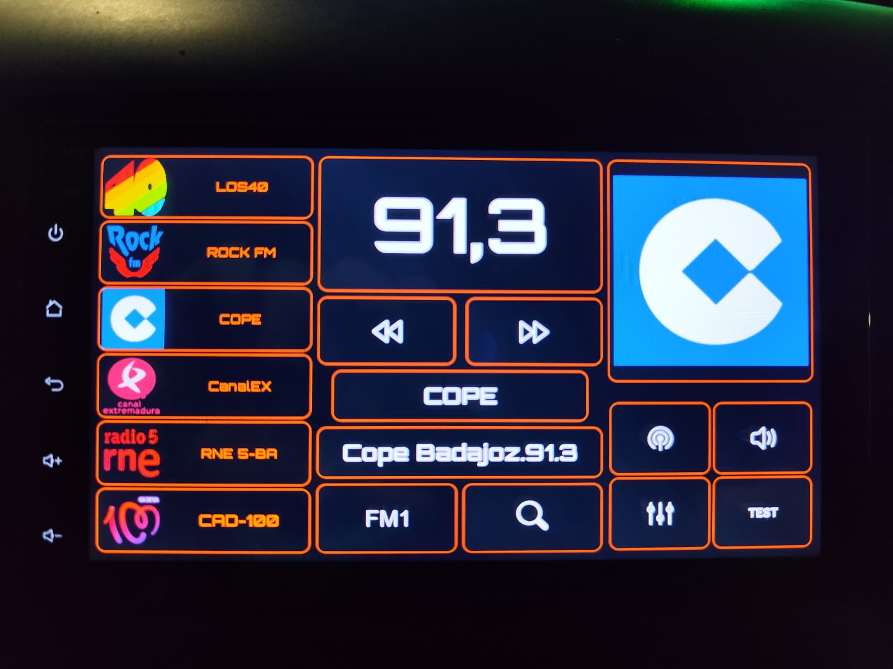

# OpenRadioFM 📻

**OpenRadioFM** es una aplicación de radio personalizada para unidades Android de automoción, diseñada específicamente para hardware basado en **MT8163** (HCN/AutoRadio). Ofrece una interfaz premium "Black & Orange" inspirada en sistemas de infotainment de alta gama, con efectos de Glassmorphism y soporte para logos dinámicos.

<div align="center">
  
  <br>
  
</div>

## ✨ Changelog de Versiones

### v9 (Current - Seek & Polish)
- **Seek Logic Fix:** Inversión de botones de búsqueda (Arriba/Abajo) y ajuste a pasos de 0.1 MHz.
- **RDS Stability:** Solución al "petardeo" del scroll de texto y protección contra resets.
- **Default Assets:** Icono de aplicación V8 integrado y logos por defecto cuando no hay señal.

### v8 (UI Overhaul)
- **Design System:** Implementación completa de Glassmorphism y paleta "Brand Orange".
- **Typography:** Tipografía Orbitron para frecuencias y presets unificados (22sp).
- **Control:** Botones 2x2 para EQ, Test y Mute. Integración con MCU.

### v5-v7 (Core Features)
- **Hybrid Logos:** Carga de logos desde API (radio-browser.info) con fallback local.
- **Hardware Integration:** Binding directo con servicio `com.hcn.autoradio`.

## 🛠️ Tecnologías

- **Android SDK:** Java & XML / Clean Architecture.
- **Redes:** Retrofit 2 & Gson.
- **Imágenes:** Glide (Caching avanzado).
- **Reflection:** Acceso a APIs ocultas de Android (McuManager, RadioPlayer).

## 🚀 Instalación

1. **Clonar:**
   ```bash
   git clone https://github.com/kapi21/OpenRadioFM.git
   ```
2. **Instalar (ADB WiFi):**
   ```bash
   adb connect <ip-radio>:5555
   adb install -r app/build/outputs/apk/debug/app-debug.apk
   ```

---
**Desarrollado con ❤️ por Jaime para la comunidad Android Head Unit.**
