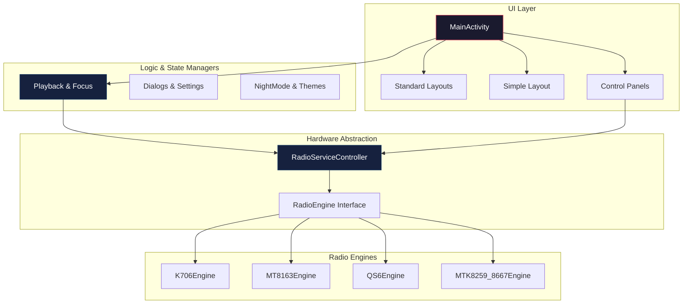

# OpenRadioFM 📻

[]()

[](LICENSE)
[]()
[]()

**Aplicación de radio FM premium para Android Head Units**, con soporte para hardware MediaTek MT8163 K706 y actualmente trabajando para modelo QS NWD y otros en versiones iniciales.  
Interfaz Glassmorphism, RDS completo (PS, RT, PTY, AF, TA, TP), y personalización avanzada.

<div align="center">
  
  <br>
  <p><i>Capturas de la versión 4.0:</i></p>
  
  
  <br><br>
  <p><i>Capturas de la version 4.7:</i></p>
  
  
</div>

---

## 🎯 Funciones Principales

| Función | MT8163 | K706 |
|---|:---:|:---:|
| Sintonización FM | ✅ | ✅ |
| Seek / AutoScan | ✅ | ✅ |
| RDS PS (nombre emisora) | ✅ | ✅ |
| RDS RT (texto informativo) | ✅ | ✅ |
| RDS PTY (tipo programa) | ✅ | ✅ |
| AF (frecuencias alternativas) | ✅ | ✅ |
| TA (anuncios de tráfico) | ✅ | ✅ |
| TP (indicador) | ✅ | ✅ |
| DX/Local | ✅ | ✅ |
| Stereo / Mono | ✅ | ✅ |
| Layouts múltiples (V2/V3) | ✅ | ✅ |
| Glassmorphism UI | ✅ | ✅ |
| Temas / Night Mode | ✅ | ✅ |
| Logos de emisora | ✅ | ✅ |
| Logos Online (Supabase) | ✅ | ✅ |
| 18 favoritos × 3 bandas | ✅ | ✅ |
| Nav. Hardware Favoritos | ✅ | ✅ |
| Soporte Android Auto | ✅ | ✅ |
| Multilingüe (ES/EN/RU/RO/UK/SR/FR/DE) | ✅ | ✅ |
| Streaming Online (MP3/HLS/AAC) | ✅ | ✅ |


---

## 🏗️ Arquitectura


```mermaid
graph TB
    subgraph "UI Layer"
        MA[MainActivity]
        STM[Standard Layouts]
        SLM[Simple Layout]
        CPM[Control Panels]
    end

    subgraph "Logic & State Managers"
        PM[Playback & Focus]
        DM[Dialogs & Settings]
        NM[NightMode & Themes]
    end

    subgraph "Hardware Abstraction"
        RS[RadioServiceController]
        RE[RadioEngine Interface]
    end

    subgraph "Radio Engines"
        K706[K706Engine]
        MT[MT8163Engine]
        QS[QS6Engine]
        MTK[MTK8259_8667Engine]
    end

    MA --> STM
    MA --> SLM
    MA --> CPM
    MA --> PM
    PM --> RS
    CPM --> RS
    RS --> RE
    RE --> K706
    RE --> MT
    RE --> QS
    RE --> MTK

    style MA fill:#1a1a2e,stroke:#e94560,color:#fff
    style PM fill:#16213e,stroke:#0f3460,color:#fff
    style RS fill:#16213e,stroke:#0f3460,color:#fff
```

---

## 📱 Hardware Compatible

| Dispositivo | Chip | Motor | Estado |
|---|---|---|---|
| HCN AutoRadio (ESSGO, JUNSU) | MediaTek MT8163 | `FM_MT8163` | ✅ Completo |
| Radio K706 | K706 + MCU | `FM_K706` | ✅ Completo |
| Radio MTK8259 / 8667 | MT8259 + MCU | `FM_MT8259` | 🛠️ En desarrollo |
| Radio NWD G5 | NWD Platform | `FM_QS6` | 🛠️ En desarrollo |
| Otros Android Head Units | Varía | `FM_BASICO` | ⚠️ Solo UI |

---

## 🛠️ Compilación

### Requisitos
- Android Studio Hedgehog+ o SDK 34
- JDK 17
- Gradle 9.x (incluido en wrapper)

### Build
```bash
# Clonar
git clone https://github.com/tu-usuario/OpenRadioFM.git
cd OpenRadioFM

# Compilar
./gradlew assembleDebug

# APK generado en:
# app/build/outputs/apk/debug/app-debug.apk
```

### Instalación en Head Unit
```bash
adb install -r app/build/outputs/apk/debug/app-debug.apk
```

---

## ⚠️ Problemas Conocidos (Marzo 2026)
- **Audio Focus (K706)**: ✅ Resuelto. Centralización de foco en RadioManager para evitar cortes por conmutación de canal MCU (Channel 2/4).
- **Seek por Hardware (K706)**: Interactúa con el volumen en algunos firmwares (pendiente investigación MCU).
- **Layout V2**: Algunos iconos pueden tener áreas de pulsación solapadas por otros elementos de la UI.

---

## 📖 Documentación

- [Manual de Usuario (Español)](_DOCS/manual_usuario.md)
- [User Manual (English)](_DOCS/manual_user_en.md)
- [Руководство пользователя (Русский)](_DOCS/manual_user_ru.md)
- [Compatibilidad de Hardware](docs/HW_COMPATIBILITY.md)
- [Changelog](CHANGELOG.md)
- [Roadmap](_DOCS/roadmap.md)

---

## 📜 Historial de Versiones

### v18.6.0 "The Great Decoupling" (9 de Marzo 2026)
- **Refactorización Arquitectónica Total**: `MainActivity` ahora es ligera, delegando responsabilidades en:
    - `HardwareManager`: Gestión de comandos MCU y estado de hardware.
    - `ControlPanelManager`: Control de botones físicos y utilidades.
    - `StandardLayoutManager`: Gestión de los layouts tradicionales V1, V2 y V3.
    - `StationAdapter`: Lógica independiente para listas de estaciones.
- **Modo Noche Premium (Simple Layout)**: Implementación exhaustiva del **Azul Noche** (`#1A237E`) en todos los elementos visuales (frecuencia, RDS, botones, reloj e icono cloud).
- **Reparación de Sintaxis**: Solucionados errores de compilación críticos y referencias rotas entre managers y diálogos.
- **Estandarización de Servicios**: Actualizado el motor MTK8259 a `MainUI` para compatibilidad según requerimientos de Csaba.

### v18.5.2 "Advanced Cloud & UI Customization" (Marzo 2026)
- **Supabase Storage Integration**: Ahora la app sube los archivos de imagen locales (`.png`/`.jpg`) directamente al almacenamiento de Supabase, garantizando que otros usuarios puedan ver el logo compartido.
- **Identificación de Dispositivo**: Implementado `user_id` basado en el `ANDROID_ID` para trazar las contribuciones a la nube y evitar colisiones de datos.
- **Reloj Digital Premium**: Nueva opción en Layout 3 para alternar entre el logo del coche y un reloj digital de gran formato con auto-dimensionado.
- **Soporte MTK8259_8667 (Alfa)**: Iniciada la integración para unidades 8259/8667 con soporte para RDS y cambio de bandas mediante pulsación larga.
- **Reorganización Pro**: Limpieza masiva del repositorio. Logs y scripts movidos a carpetas locales excluidas de Git para un mantenimiento profesional.
- **UI Fix**: Implementación de `Barrier` en Layout 3 para evitar solapamientos entre el icono de nube y el nuevo reloj.

### v4.8 "Cloud Server Release" (Marzo 2026) - BETA
- **Audio Focus Inteligente (K706)**: Centralizada la gestión de foco en el hardware para evitar que el MCU apague la FM al detectar sonido de Android.
- **Internacionalización**: Añadidos **Francés (FR)**, **Alemán (DE)** y **Rumano (RO)**.
- **Fix de Frecuencia**: Eliminado el mensaje "Buscando..." en favoritos al cambiar de emisora.
- **Identidad v4.8**: Actualizados todos los nombres de versión a "Cloud_Server".
- **Recuperación de canal**: `MainActivity` ahora fuerza la restauración del canal FM al volver del segundo plano.

### v4.7.5 "Cloud Intelligence & UI Perfection" (Marzo 2026)
- **Crowdsourcing (Contribución Cloud)**: Los usuarios ahora pueden alimentar la base de datos de logos enviando RDS PS y PI Code automáticamente.
- **Cloud Cache Reset**: Pulsación larga en el icono de nube para invalidar la caché local y forzar la recarga de logos/streams.
- **Localización Completa**: Añadidos manuales y recursos para **Alemán (DE)**, **Italiano (IT)** y **Portugués (PT)**.
- **Fix de Modo Noche**: El icono de actividad de red ahora hereda correctamente el tinte azul noche.
- **Optimización RDS PTY**: Eliminado icono redundante para mejorar la legibilidad de categorías de radio.

### v18.5.1 "QS6 Tuning & AM Optimization" (Marzo 2026)
- **Optimización AM**: Deshabilitada la búsqueda de logos en Supabase para banda AM para evitar bloqueos y mejorar la fluidez.
- **QS6 Seek/Fine Fix**: Corregida la sintonización automática e incremental para que coincida con el paso del hardware.
- **Secuencia de Apagado QS6 (Beta)**: Implementación de la secuencia V18.4 con `ACTION_REQUEST_CHANGE_SOURCE` y desvinculación AIDL proactiva.
- **Limpieza de Recursos**: Mejora en el cierre de hilos de red en `RadioRepository` durante el apagado de la app.
- **Audio Focus**: Refinamiento en la gestión del foco para asegurar el silencio tras el cierre.

### v16.3.0 "Online Logos & Stability" (Marzo 2026)
- **Sistema de Logos Online (Supabase)**: Búsqueda centralizada de logos por PI Code, RDS Name y Frecuencia, con contribución comunitaria automática.
- **Caché Negativa**: Evita reintentos infinitos de búsqueda cuando un logo no existe en el servidor.
- **Menú DEV**: Toggle para activar/desactivar el sistema de logos online en ambos motores (MT8163 y K706).
- **Radio-Browser Estabilizado**: Endpoint migrado a `at1.api.radio-browser.info` para mayor fiabilidad.
- **Sincronización de Hilos**: Contador de actividad de red movido al UI Thread para evitar parpadeos permanentes del icono de datos.
- **Bug Fix**: Corregida lectura de preferencias en `downloadAndSaveLogo` (leía del archivo incorrecto).

### v5.7.0 "Dynamic PS Scaling" (Marzo 2026)
- **Auto-dimensionado de Texto**: La frecuencia/nombre de emisora ahora se escala dinámicamente en ambos layouts para evitar recortes.
- **Optimización de Espacio**: Reducción de márgenes laterales y ajuste de fuente mínima a 20sp para nombres extra largos.

### v5.6.0 "NighMode Polish" (Marzo 2026)
- **UI NightBlue**: El botón PowerOff ahora hereda el color azul noche en el modo nocturno.
- **PTY Agrandado**: Icono y texto de Tipo de Programa un 30% más grandes en Layout 2.
- **Clean UI**: Eliminación total de placeholders "Sin datos RDS RT" para una interfaz vacía más elegante.

### v5.5.0 "Manager & RDS Architecture" (Marzo 2026)
- **Refactorización V5.5**: Creación de `PlaybackManager` (Audio/Mute) y `DeviceManager` (Hardware/Power) para desacoplar `MainActivity`.
- **RDS PS Dinámico**: Sustitución inteligente de la frecuencia por el nombre de la emisora (RDS PS) o nombre personalizado.
- **Optimización Layout 2**: Reestructuración de PTY y alineación de iconos con mayores tamaños para mejorar la visibilidad.
- **Limpieza Estructural**: Eliminación de placeholders redundantes y directorios vacíos.

### v5.2.0 "Power & Focus Integration" (Marzo 2026)
- **Botón de Apagado**: Implementado en todos los layouts para un cierre seguro y liberación inmediata del canal de audio.
- **Recuperación de Audio Focus**: Sistema de autocuración mejorado para Spotify y llamadas.
- **Unificación de Interfaz**: Añadido `closeDevice()` a la capa de abstracción `RadioEngine`.

### v4.7.0 "Car & Audio Integration" (Marzo 2026)
- **Soporte Android Auto**: Integración completa mediante `MediaSession` y `MediaBrowserService`. Los favoritos ahora aparecen como una lista navegable en el coche.
- **Refactorización Core**: Modularización de `MainActivity` mediante `NightModeManager`, `HistoryManager` y `PresetManager`.
- **Media Control**: Comando de pausa/play mapeado al botón de Mute para controles remotos y volante.
- **Limpieza de Recursos**: Optimización drástica de `onDestroy` para evitar fugas de memoria en head units con poca RAM.

### v4.6.1 "Stable Integration" (Marzo 2026)
- **Navegación Hardware:** Control de emisoras favoritas directamente desde mandos al volante y botones de hardware (MCU K706 / Reflexión MT8163).
- **Easter Egg Hacker:** Nuevo diálogo de créditos premium con la imagen del desarrollador Jimmy80.
- **Barra de Estado Opcional:** Configuración para mostrar/ocultar la status bar de Android en el Layout 2.
- **Modo Noche Total:** Tintado unificado para todos los indicadores (ST, PTY, AF, TA, TP).


### v4.6 "Beta Integration" (Febrero 2026)
- **Dual Hardware:** Unificación de motores MT8163 y K706 en una sola APK.
- **Soporte QS6 G5:** Integración inicial para plataformas NWD G5.
- **RDS AF/TA/TP:** Funcional en ambos motores con iconos interactivos.
- **Localización:** Añadidos idiomas Rumano, Ucraniano y Serbio.
- **DX/Local:** Toggle funcional para K706 con feedback visual.
- **Layout V3:** Corrección del desplazamiento causado por el icono Stereo.
- **Fuente Formula 1:** Integración tipográfica premium para la frecuencia.
- **Bug Fix:** Corrección de la frecuencia "00.0" en MT8163 durante el arranque.

<details>
<summary>Versiones anteriores</summary>

### v4.5.1 "Server Test"
- Indicador de señal dinámico (verde/amarillo/rojo)
- Layout 3 refinado con Glass Mode
- PTY multilingüe

### v4.0 "Global Edition"
- Multi-Hardware Engine (HCN, MTK, TS, SYU)
- Night Mode con programación horaria

### v3.0 "The Car Experience"
- Rediseño completo de interfaz horizontal (V3)
- Glassmorphism y menús premium

### v2.0b
- Interfaz Glassmorphism y fondos personalizados

### v1.0b
- Versión inicial con sintonización básica y logos
</details>

---

## 📄 Licencia

```
Copyright 2025-2026 Jimmy80

Licensed under the Apache License, Version 2.0.
See LICENSE file for details.
```

---

**Desarrollado con ❤️ por Jimmy80 para la comunidad Android Head Unit.**
