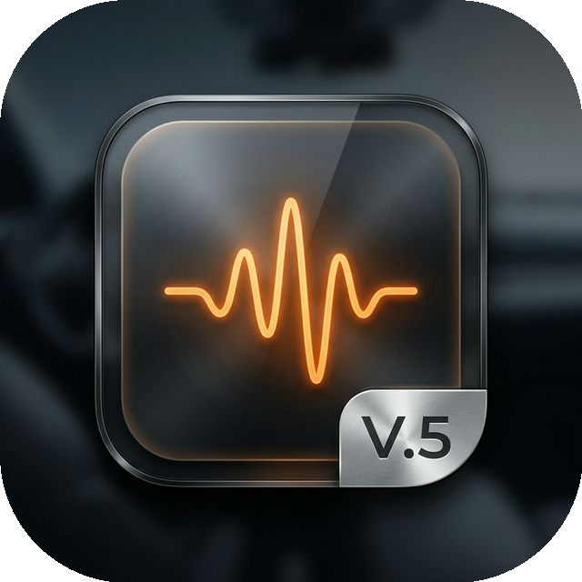
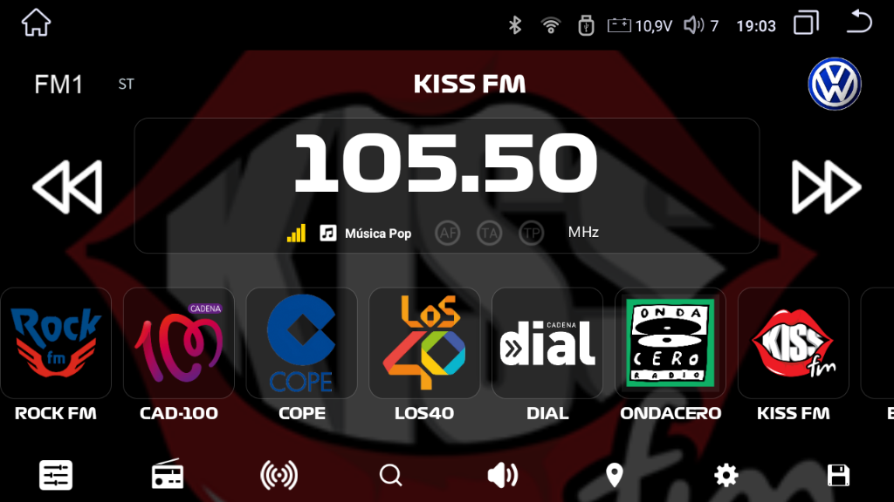
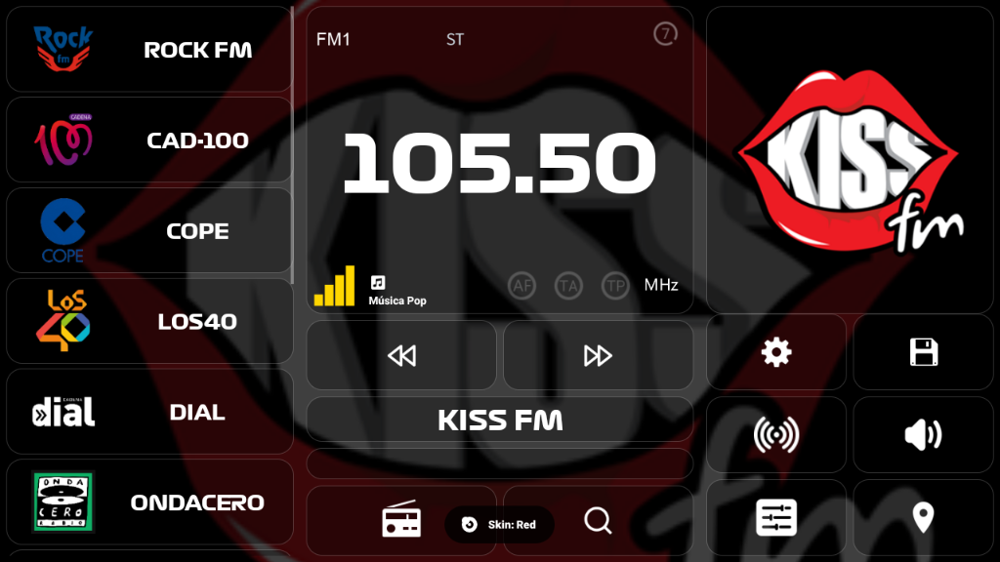
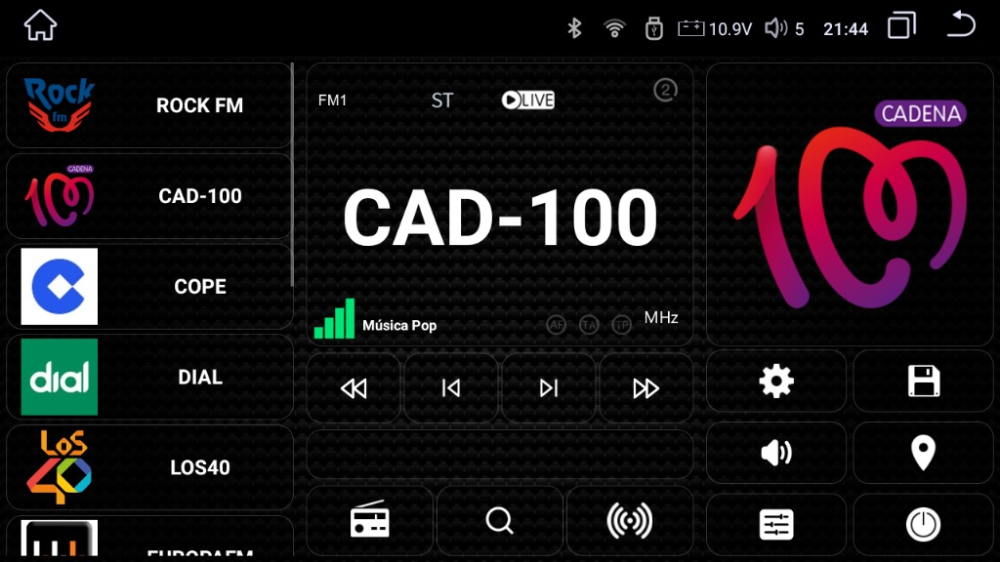
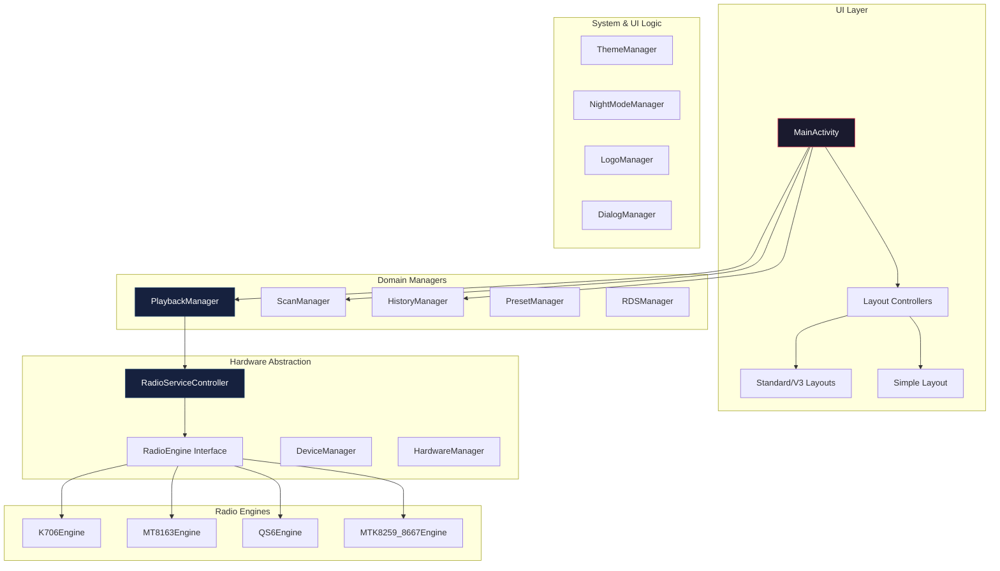

# OpenRadioFM - Community Logo Edition 📻

[-red.svg)]()

[](LICENSE)
[]()
[]()

**Aplicación de radio FM premium para Android Head Units**, con soporte activo para **K706**, **MT8163 (Junsun V1 Pro)** y las plataformas **MTK 8227L / 8259 / 8667**.  
Interfaz Glassmorphism, RDS completo (PS, RT, PTY, AF, TA, TP), y personalización avanzada de logos y temas.

<div align="center">
  
  <br>
  <p align="center"><b>【 GALERÍA DE CAPTURAS 】</b></p>
  
  
  <br><br>
  <p align="center"><b>【 NUEVO LAYOUT V3 - Stability Beta 5.0 】</b></p>
  
  
  <br><br>
  <p align="center"><b>【 PRESENTACIÓN V5 - ESTABILIDAD BETA 】</b></p>
  
  <br><br>
  <p align="center"><b>【 GUÍA DEL SISTEMA DE LOGOS V5 】</b></p>
  
</div>

---

## 🎯 Funciones Principales

| Función | MT8163 / Junsun | K706 | MTK8259/8667 |
|---|:---:|:---:|:---:|
| Sintonización FM | ✅ | ✅ | ✅ |
| Seek / AutoScan | ✅ | ✅ | ✅ |
| RDS PS (nombre) | ✅ | ✅ | ✅ |
| RDS RT (información) | ✅ | ✅ | ✅ |
| AF / TA / TP | ✅ | ✅ | ✅ |
| DX / Local | ✅ | ✅ | ✅ |
| Stereo / Mono | ✅ | ✅ | ✅ |
| Layouts (V2 / V3) | ✅ | ✅ | ✅ |
| Temas / Night Mode | ✅ | ✅ | ✅ |
| Logos HD (Supabase) | ✅ | ✅ | ✅ |
| Soporte Android Auto | ✅ | ✅ | ✅ |
| Streaming Online | ✅ | ✅ | ✅ |


---

## 🏗️ Arquitectura


```mermaid
graph TB
    subgraph "UI Layer"
        MA[MainActivity]
        LCN[Layout Controllers]
        STM[Standard/V3 Layouts]
        SLM[Simple Layout]
    end

    subgraph "Domain Managers"
        PM[PlaybackManager]
        SM[ScanManager]
        HM[HistoryManager]
        PRM[PresetManager]
        RDS[RDSManager]
    end

    subgraph "System & UI Logic"
        TM[ThemeManager]
        NM[NightModeManager]
        LM[LogoManager]
        DM[DialogManager]
    end

    subgraph "Hardware Abstraction"
        RSC[RadioServiceController]
        REI[RadioEngine Interface]
        DEV[DeviceManager]
        HWM[HardwareManager]
    end

    subgraph "Radio Engines"
        K706[K706Engine]
        MT[MT8163Engine]
        QS[QS6Engine]
        MTK[MTK8259_8667Engine]
    end

    MA --> LCN
    LCN --> STM
    LCN --> SLM
    MA --> PM
    MA --> SM
    MA --> HM
    PM --> RSC
    RSC --> REI
    REI --> K706
    REI --> MT
    REI --> QS
    REI --> MTK
    
    style MA fill:#1a1a2e,stroke:#e94560,color:#fff
    style PM fill:#16213e,stroke:#0f3460,color:#fff
    style RSC fill:#16213e,stroke:#0f3460,color:#fff
```

---

## 📱 Hardware Compatible

| Dispositivo | Chip | Motor | Colaborador |
|---|---|---|---|
| JUNSUN V1 Pro / Topway | MediaTek MT8163 | `FM_MT8163` | ✅ |
| Radio K706 / HCN / Vento | K706 + MCU | `FM_K706` | ✅ |
| MTK 8227L / 8259 / 8667 | MediaTek | `FM_MT8259` | 🤝 Csaba Edition |
| Radio NWD G5 | Qualcomm | `FM_QS6` | 🛠️ En desarrollo |
| Otros Android Head Units | Varía | `FM_BASICO` | ⚠️ Solo UI |

---

## 🛠️ Compilación

### Requisitos
- Android Studio Hedgehog+ o SDK 34
- JDK 17
- Gradle 9.x (incluido en wrapper)

### Build
```bash
# Clonar
git clone https://github.com/kapi21/OpenRadioFM.git
cd OpenRadioFM

# Compilar
./gradlew assembleDebug

# APK generado en:
# app/build/outputs/apk/debug/app-debug.apk
```

### Instalación en Head Unit
```bash
adb install -r app/build/outputs/apk/debug/app-debug.apk
```

---

## ⚠️ Problemas Conocidos (Marzo 2026)
- **Audio Focus (K706)**: ✅ Resuelto. Centralización de foco en RadioManager para evitar cortes por conmutación de canal MCU (Channel 2/4).
- **Seek por Hardware (K706)**: Interactúa con el volumen en algunos firmwares (pendiente investigación MCU).
- **Layout V2**: Algunos iconos pueden tener áreas de pulsación solapadas.
- **Audio QS6 (Qualcomm)**: ⚠️ El sonido no se activa a pesar de la sintonía. El ID de fuente de audio nativo está en investigación.

---

## 📖 Documentación

- [Manual de Usuario (Español)](_DOCS/manual_usuario.md)
- [User Manual (English)](_DOCS/manual_user_en.md)
- [Руководство пользователя (Русский)](_DOCS/manual_user_ru.md)
- [Compatibilidad de Hardware](docs/HW_COMPATIBILITY.md)
- [Ingeniería inversa — radio OEM K706 (`com.android.fmradio.ext`)](docs/ESTUDIO_INGENIERIA_INVERSA_K706_RADIO_OEM.md)
- [Comparativa motor K706 OpenRadioFM vs radio OEM](docs/COMPARATIVA_K706_OPENRADIO_VS_OEM.md)
- [Inteligencia QS NWD (Qualcomm)](docs/INTELIGENCIA_QS_NWD.md)
- [Changelog](CHANGELOG.md)
- [Roadmap](_DOCS/roadmap.md)

---

## 🤝 Cómo Contribuir

- **Issues**: Si encuentras un bug o comportamiento raro en tu radio (modelo, firmware, chip, versión de app), abre un *Issue* detallando:
  - Modelo exacto de la head unit (HCN, K706, QS6, MTK8259, etc.).
  - Versión de OpenRadioFM (por ejemplo `v4.9.3_Stable`).
  - Pasos para reproducir el problema y, si es posible, logs o fotos/vídeos.
- **Pull Requests**: Se aceptan mejoras de código, refactors y nuevas traducciones:
  - Intenta mantener el estilo actual (Java para el core; Kotlin bienvenido para piezas nuevas).
  - Acompaña los cambios con una breve explicación en el PR y, si afecta a la UX, con capturas.
  - Para cambios grandes (refactor de motores, arquitectura, etc.), es recomendable comentar primero en un Issue para alinear el enfoque.

---

## 📜 Historial de Versiones

### v5.0.1 "K706 hotfix" (22 de Marzo 2026)
*Build de corrección; no sustituye el anuncio de release 5.0.0 — útil para subir **APK debug/firmado** a GitHub como asset “fixed” / pre-release.*

- **K706 — Llamadas entrantes / salientes**:
  - Solicitud en tiempo de ejecución de **`READ_PHONE_STATE`** (Android 6+); sin permiso el sistema no notifica llamadas y la FM podía seguir sonando.
  - Tras colgar: restauración reforzada (**`SetChannel(2)`**, audio, **`requestPlayAudio()`**).
- **K706 / volante y sesión multimedia**:
  - **NEXT / PREVIOUS** del volante y de **MediaSession** / notificación avanzan o retroceden **frecuencia (seek)**, no memorias.
- **Documentación**: comparativa OEM K706, estudio radio OEM, script jadx opcional (`docs/`).

### v5.0.0 "Stability Beta" (21 de Marzo 2026)
- **Hardware Stability & Contributor Support**:
    - **Csaba Edition**: Integración oficial de soporte para MTK 8227L / 8259 / 8667 de la mano de Csaba.
    - **Junsun V1 Pro**: Optimización del motor MT8163 para dispositivos Junsun.
    - **Protección de Red (SST)**: Parche crítico para `NoClassDefFoundError` en Retrofit/Supabase.
    - **Protección AM**: Eliminada la opción de desactivar AM para evitar bloqueos del motor en Topway.
    - **Precisión de Sintonía**: Implementado cálculo manual de pasos de frecuencia en MTK para sintonización exacta.
    - **Instancia Única**: Corregida la duplicidad del motor MT8163 en reconexiones del servicio AIDL.
- **Personalización Premium**:
    - **Light Mode**: Nuevo skin "White" completamente funcional con visibilidad optimizada.
    - **Transparencia Real**: Sincronización de opacidad en todas las tarjetas y layouts.
- **Core Polish**:
    - Fix de crash por recursividad de iconos en el lanzador.
    - Mitigación de parpadeo (flicker) en el texto RDS.

### v4.9.5 "Audio Focus & Sequential Presets" (19 de Marzo 2026) - STABLE
- **Audio Focus K706 (Fix Crítico)**:
    - Rediseñada la lógica de `onAudioFocusChange` para respetar la pérdida permanente de foco.
    - El canal MCU (Channel 4) ahora se libera correctamente al perder el foco, permitiendo que otros reproductores (Spotify, etc.) suenen sin interferencias.
    - Corregido el bucle de auto-recuperación agresiva.
- **Navegación Secuencial de Presets**:
    - Los botones de Favorito Siguiente/Anterior ahora recorren los slots (1-18) de forma numérica.
    - Salto automático de slots vacíos y comportamiento circular por banda.

### v4.9.4 "Streaming & Stability Polish" (19 de Marzo 2026) - STABLE
- **Streaming Online Pro (Icecast & M3U)**:
    - **Resolución de Playlists**: Añadido soporte automático para ficheros `.m3u` y `.pls`. La app ahora extrae la URL real del stream en segundo plano, permitiendo sintonizar emisoras que antes daban error de formato.
    - **Compatibilidad Icecast SSL**: Forzado automático de protocolo **HTTP** en puertos no estándar (8xxx/9xxx). Esto soluciona los fallos de conexión por certificados desactualizados en hardware antiguo.
    - **Mime Type Forcing**: Detección mejorada de streams MPEG (`audio/mpeg`) para URLs que terminan en `/stream`.
- **Fix de Audio Duplicado**:
    - **Protección de Ciclo de Vida**: Corregido bug donde la radio FM se reactivaba al volver a la app mientras el streaming LIVE seguía sonando.
    - **Mute Guard**: El sistema de recuperación de audio ahora respeta el estado del streaming activo para no desmutear la radio física innecesariamente.
- **Estabilidad de Instancia**:
    - **SingleTask Launch**: Configurado `launchMode="singleTask"` en el manifiesto para evitar que algunos launchers OEM creen múltiples instancias de la app al volver desde el escritorio.

### v4.9.3 "Hijacker & Layout Refinement" (15 de Marzo 2026) - STABLE
- **Intent Hijacking (Interceptación de Botón Físico)**:
    - Implementación de `FactoryRadioHijackerService` (Servicio de Accesibilidad) para interceptar el botón RADIO físico en unidades K706 (y similares), permitiendo que OpenRadioFM se abra automáticamente sobre la app de fábrica sin necesidad de Root.
- **Refinamiento Estético Layout 3 (V3)**:
    - **Clean UI**: Los boxes genéricos de control (RDS, bandas, búsqueda) son ahora completamente planos (sin bordes) para un aspecto más moderno.
    - **Skins Focalizados**: Los colores de los Skins (Night, Classic, Orange, etc.) ahora se aplican exclusivamente a las cajas de favoritos (P1-P12).
    - **Neutralidad de Frecuencia**: El recuadro de frecuencia conserva un borde neutro transparente (`bg_glass_card_classic`) independiente del skin seleccionado.
- **Motor MTK8259 Polish**:
    - Optimización del método `forceUnmute()` eliminando el comando redundante de Mute para mejorar la estabilidad del canal de audio al arrancar.
- **Branding**:
    - Reducción del nombre en el lanzador a simplemente "OpenRadioFM" para mayor limpieza visual en el escritorio de la radio.

### v4.9.0 "Community Logo Edition" (14 de Marzo 2026) - STABLE
- **Enfoque Comunitario**: Nueva edición centrada en la base de datos de logos compartidos por la comunidad.
- **Refinamiento de UI Individual**:
    - **Reubicación de Favorito**: El icono de favorito se ha trasladado a la barra superior en ambos layouts principales para una visualización más limpia.
    - **Optimización de Espacio**: Reajustado el tamaño de los iconos de estado y nube (120dp) para garantizar la visibilidad del indicador de favorito.
    - **Señal MT8163**: Corregido bug donde el icono de señal quedaba blanco; ahora se colorea en tiempo real mediante el bucle asíncrono (verde en estéreo, amarillo en mono).
- **Core Stability & Motores**:
    - **Auditoría MainActivity**: Saneamiento de código obsoleto, reemplazo de `NetworkInfo` por `NetworkCapabilities`, mejoras de null-safety en streaming online y eliminación de callbacks duplicados.
    - **MTK8259 Engine Polish**:
        - Fix crítico en `onManualUp`/`onManualDown` que forzaba el salto entre presets de fábrica en lugar de buscar frecuencias (calculado manualmente a intervalos de 100KHz y 9KHz).
        - Desacoplamiento total de `AudioManager` para la lógica de Mute, delegando exclusivamente al SoC `TsCommon` según hardware specs.
        - Fix de Crash al cambiar Layout provocado por callbacks `DeadObject` del RDS polling.
- **Shadow Motor QS6 (Redundancia)**:
    - **Broadcast Monitoring**: Nueva lógica para capturar frecuencias y RDS PS directamente desde el bus del sistema (`ACTION_SEND_RADIO_FREQUENCE_NEW`).
    - **Settings Observer**: Monitorización de `nwd_radio_current_freq` para refrescar la UI independientemente de fallos en el servicio AIDL.
- **Saneamiento Android 13+**: Registro de receptores con flag `RECEIVER_EXPORTED`.
- **Estabilidad General**: Mejoras en la persistencia de datos y eliminación de parpadeos en las actualizaciones de RDS.

### v21.1 "QS6 Shadow Motor & Android 13" (14 de Marzo 2026)
- **Implementación del Shadow Motor (Redundancia QS6)**:
    - **Broadcast Monitoring**: Nueva lógica para capturar frecuencias y RDS PS directamente desde el bus del sistema (`ACTION_SEND_RADIO_FREQUENCE_NEW`), evitando parálisis si el servicio AIDL de Qualcomm colapsa.
    - **Settings Observer**: Monitorización en tiempo real de `nwd_radio_current_freq` para refrescar la UI independientemente de los callbacks remotos.
    - **Comandos Redundantes**: Los cambios de frecuencia ahora se envían también vía Intent por si el proxy AIDL está bloqueado.
- **Saneamiento Android 13+ (API 33)**: 
    - Corregido el regitro de receptores añadiendo el flag obligatorio `RECEIVER_EXPORTED` para permitir la comunicación entre apps de sistema y la radio.
- **Optimización de Rendimiento**:
    - **Anti-Lag**: Implementado filtrado de actualizaciones de frecuencia para evitar el parpadeo de la UI durante cambios rápidos por parte del hardware.
    - **Persistence Refinement**: Corregida la duplicidad de registros del Shadow Motor en los ciclos de vida de la Activity.
- **Estado QS6**: Estabilidad total en UI, sintonía y RDS. El desarrollo de sonido queda en pausa temporal tras la reversión de las pruebas inestables v21.2-v21.5.

### v20.0 Alpha "QS6 Robustness & MTK Volume" (13 de Marzo 2026)
- **Robustez Crítica Motor QS6 (NWD Platform)**:
    - **AIDL Resilience**: Implementación de un wrapper `performAidlCall` que captura `DeadObjectException` y relanza la vinculación del servicio automáticamente.
    - **Auto-Rebind Loop**: Sistema de 3 reintentos de conexión forzada ante fallos críticos del proceso remoto del sistema.
    - **Estabilización de Arranque**: Introducción de un retardo táctico de 500ms en `onEngineReady` para evitar colisiones con el kernel durante la carga del layout.
    - **Persistence Fix**: Gestión inteligente de `unbindService` para mantener el audio fluyendo durante la recreación de la Activity (cambios de orientación).
- **Corrección de Volumen MTK 8259**: 
    - Implementación de `setVolumeControlStream` en `MainActivity` para forzar el control del stream de música por defecto.
    - Integración de gestión de **AudioFocus** en `MTK8259_8667RadioManager`.
    - Solucionado el bug de "doble pulsación" necesaria para mostrar la barra de volumen del sistema.
- **Estabilización de RDS (Feedback Csaba)**:
    - Eliminado el parpadeo del RDS Text en el motor MTK mediante la optimización del ciclo de refresco de texto.
    - Actualizada la interfaz de hardware `ITsCommon.aidl` con soporte para `GetAudioSessionId` y `GetRadioSessionId`.
- **Depuración de Layouts & Clics**:
    - **UI Clearance**: Reajuste de guidelines en el Layout Estándar y V3 (frecuencia al 48%) para evitar el solapamiento físico con botones de control.
    - **Fix de Interrupción**: Restaurados los clics inmediatos en botones AF/TA/TP que anteriormente quedaban bloqueados por el TextView de frecuencia.
    - **Instant Logo Clear**: Los logos se limpian instantáneamente al iniciar una sintonía, eliminando el efecto de "logo pegado" del hardware lento.

### v19.5 "Cloud ID & Premium Layout Refinement" (12 de Marzo 2026)
- **Identificación Única (Cloud Sync)**:
    - **Hardware ID Mapping**: Implementada la utilidad `DeviceMetadataUtils` para asignar un ID persistente a cada unidad (basado en Serial de HW para K706/MT8163 o Android ID/UUID).
    - **Supabase Device Tracking**: La base de datos ahora registra el `device_id` en cada reporte de estación para mejorar la moderación de logos y métricas.
- **Refinamiento Estético Premium**:
    - **Layout V3 Transparency**: El contenedor de RDS RT ahora es 100% transparente, logrando un diseño más limpio integrado en el fondo.
    - **Geometría de Interfaz**: Reducción del tamaño del icono de señal (44dp) y ajuste de altura de la frecuencia en V3 para evitar solapamientos.
- **Estabilización de Motores**:
    - **MT8163 Full Restore**: Recuperada la funcionalidad de RDS RT y nombres de emisora tras la regresión de la sesión anterior.
    - **MTK8259 Polish**: Corregido el intercambio de datos entre PTY y Texto. Se ha fijado el icono de Mute a un estado estático profesional (`radio_mute_n`).
    - **K706 Band Fix**: Resuelto el problema visual donde las bandas AM se mostraban con iconos de FM.

### v4.8.5 "UI Stability & Anti-Flicker Pro" (11 de Marzo 2026)
- **Eliminación de Parpadeo (Fases 2.5 - 2.7)**:
    - **Master Guard de Hilos**: Implementado un sistema de bloqueo reactivo que reduce la creación de hilos en un 90% cuando la radio está estática.
    - **Estabilización SPRD/Unisoc**: Eliminado el jitter periódico de 5s mediante la desactivación del heartbeat forzado y optimización del compositor de hardware.
    - **Notificaciones Inteligentes**: El servicio de medios ahora utiliza guardas de estado para evitar la inundación de notificaciones redundantes en milisegundos.
- **Limpieza de IPC**: 
    - Silenciado de broadcasts del sistema denegados para reducir el ruido en el bus de datos y liberar recursos del hilo principal.
    - Aplicación de guardas visuales estrictas (`IfChanged`) en fondos, filtros de color y recursos de imagen.
- **Depuración de Crashing**:
    - Corregido error crítico de índice fuera de rango al activar el Mute/Unmute desde la notificación.

### v4.8.4 "V5.0 Phase 1: The Core Decoupling" (11 de Marzo 2026)
- **Desacoplamiento Masivo (V5.0 Fase 1)**:
    - **ScanManager**: Extracción completa de la lógica de búsqueda de emisoras de `MainActivity`. Centralización de estados de escaneo y diálogos manuales.
    - **HistoryManager Pro**: Sistema unificado de persistencia con soporte para 5 bandas de FM y 2 de AM, con capacidad ampliada hasta 20 presets por banda.
- **Refinamiento de Mute & Hardware**:
    - **Aislamiento de Polling**: La sincronización forzada de mute con Android ahora solo actúa en motores MTK (Csaba Fix), garantizando la estabilidad total del hardware K706 original.
    - **Mute Visual Fix**: Iconos de mute garantizados para sincronizarse instantáneamente al recuperar el audio desde cualquier fuente externa.
- **Smart Logo & RDS Polish**:
    - **Búsqueda por Nombres Cortos**: Reducción del filtro de seguridad a 2 caracteres para permitir la identificación de emisoras como "RR".
    - **Invalidación de Caché Inteligente**: Al editar un nombre manualmente, la app ahora borra la caché visual y dispara una búsqueda inmediata en Supabase con el nuevo nombre.
    - **RDS PTY Pro (MTK)**: Mejora en `RDSManager` para interpretar correctamente textos de categoría de programa en unidades Topway.

### v4.8.3 "The Cloud Robustness & Server Sync" (11 de Marzo 2026)
- **Capa de Datos de Supabase (Database)**: 
    - **Alineación de Columnas**: Sincronización total con el esquema de base de datos (`logo_url`, `hw_model`).
    - **Tipos de Datos**: Migración del campo frecuencia a `String` (MHz) para coherencia con reportes RDS.
    - **Deduplicación Automática**: Implementada lógica de servidor (PostgreSQL) para evitar emisoras repetidas mediante restricciones `UNIQUE` e `ilike`.
- **Supabase Storage (Cloud Logos)**:
    - **Path Fix**: Corrección del error 400 mediante la desactivación del encoding de Retrofit en las rutas del bucket (soporte para subcarpetas por país).
    - **RLS Policies**: Apertura de permisos para permitir subidas anónimas (`anon`) y lectura pública desde la app.
- **UI & UX Premium**:
    - **Status Indicator**: Punto de estado dinámico (`• Online` / `• Offline`) en ajustes de logos que verifica la conexión con el servidor en tiempo real.
    - **Limpieza de Menús**: Eliminación del botón de prueba manual tras estabilizar la sincronización automática.
- **Estabilidad de Red**: Integración de `HttpLoggingInterceptor` para depuración profesional de peticiones API.

### v4.8.2 "The Technical Matrix & MTK Polish" (10 de Marzo 2026)
- **Unificación del Menú de Ingeniería**: Rediseño masivo de los diálogos de diagnóstico para K706 y MTK8259, adoptando un estilo **"Technical Matrix"** unificado con secciones categorizadas por hardware, RDS y SO.
- **Correcciones Críticas MTK8259 (Feedback de Csaba)**: 
    - **RDS PTY/RT Separation**: Corregida la lógica de filtrado para evitar que el género de música (PTY) se muestre duplicado en el campo de Radio Text.
    - **Smart Mute Sync**: Implementada sincronización activa del icono de Mute. El botón se desmarca automáticamente si el usuario desmutea la radio mediante mandos al volante o el sistema Android.
    - **Hardware Mute Restore**: Restaurado el comando de silencio por HW (`TsCommon.Mute`) para garantizar fiabilidad en todas las variantes de unidades Topway.
- **Build & Quality**: 
    - Solucionados errores de parseo XML por caracteres ilegales (`<`, `>`) en etiquetas de botones.
    - Restaurado el método `updateSignalQuality` en el diálogo K706 para corregir fallos de compilación en `MainActivity`.
- **UI Refinements**: Eliminación definitiva de bordes y mejora de fondos en el **Simple Layout**.
- **Internacionalización**: Verificación y soporte completo para el idioma **Húngaro (Magyar)**.

### v4.8.1 "The Great Decoupling" (9 de Marzo 2026)
- **Refactorización Arquitectónica Total**: `MainActivity` ahora es ligera, delegando responsabilidades en:
    - `HardwareManager`: Gestión de comandos MCU y estado de hardware.
    - `ControlPanelManager`: Control de botones físicos y utilidades.
    - `StandardLayoutManager`: Gestión de los layouts tradicionales V1, V2 y V3.
    - `StationAdapter`: Lógica independiente para listas de estaciones.
- **Modo Noche Premium (Simple Layout)**: Implementación exhaustiva del **Azul Noche** (`#1A237E`) en todos los elementos visuales (frecuencia, RDS, botones, reloj e icono cloud).
- **Reparación de Sintaxis**: Solucionados errores de compilación críticos y referencias rotas entre managers y diálogos.
- **Estandarización de Servicios**: Actualizado el motor MTK8259 a `MainUI` para compatibilidad según requerimientos de Csaba.

### v4.8.0 "Advanced Cloud & UI Customization" (Marzo 2026)
- **Supabase Storage Integration**: Ahora la app sube los archivos de imagen locales (`.png`/`.jpg`) directamente al almacenamiento de Supabase, garantizando que otros usuarios puedan ver el logo compartido.
- **Identificación de Dispositivo**: Implementado `user_id` basado en el `ANDROID_ID` para trazar las contribuciones a la nube y evitar colisiones de datos.
- **Reloj Digital Premium**: Nueva opción en Layout 3 para alternar entre el logo del coche y un reloj digital de gran formato con auto-dimensionado.
- **Soporte MTK8259_8667 (Alfa)**: Iniciada la integración para unidades 8259/8667 con soporte para RDS y cambio de bandas mediante pulsación larga.
- **Reorganización Pro**: Limpieza masiva del repositorio. Logs y scripts movidos a carpetas locales excluidas de Git para un mantenimiento profesional.
- **UI Fix**: Implementación de `Barrier` en Layout 3 para evitar solapamientos entre el icono de nube y el nuevo reloj.

### v4.8 "Cloud Server Release" (Marzo 2026) - BETA
- **Audio Focus Inteligente (K706)**: Centralizada la gestión de foco en el hardware para evitar que el MCU apague la FM al detectar sonido de Android.
- **Internacionalización**: Añadidos **Francés (FR)**, **Alemán (DE)** y **Rumano (RO)**.
- **Fix de Frecuencia**: Eliminado el mensaje "Buscando..." en favoritos al cambiar de emisora.
- **Identidad v4.8**: Actualizados todos los nombres de versión a "Cloud_Server".
- **Recuperación de canal**: `MainActivity` ahora fuerza la restauración del canal FM al volver del segundo plano.

### v4.7.5 "Cloud Intelligence & UI Perfection" (Marzo 2026)
- **Crowdsourcing (Contribución Cloud)**: Los usuarios ahora pueden alimentar la base de datos de logos enviando RDS PS y PI Code automáticamente.
- **Cloud Cache Reset**: Pulsación larga en el icono de nube para invalidar la caché local y forzar la recarga de logos/streams.
- **Localización Completa**: Añadidos manuales y recursos para **Alemán (DE)**, **Italiano (IT)** y **Portugués (PT)**.
- **Fix de Modo Noche**: El icono de actividad de red ahora hereda correctamente el tinte azul noche.
- **Optimización RDS PTY**: Eliminado icono redundante para mejorar la legibilidad de categorías de radio.

### v18.5.1 "QS6 Tuning & AM Optimization" (Marzo 2026)
- **Optimización AM**: Deshabilitada la búsqueda de logos en Supabase para banda AM para evitar bloqueos y mejorar la fluidez.
- **QS6 Seek/Fine Fix**: Corregida la sintonización automática e incremental para que coincida con el paso del hardware.
- **Secuencia de Apagado QS6 (Beta)**: Implementación de la secuencia V18.4 con `ACTION_REQUEST_CHANGE_SOURCE` y desvinculación AIDL proactiva.
- **Limpieza de Recursos**: Mejora en el cierre de hilos de red en `RadioRepository` durante el apagado de la app.
- **Audio Focus**: Refinamiento en la gestión del foco para asegurar el silencio tras el cierre.

### v16.3.0 "Online Logos & Stability" (Marzo 2026)
- **Sistema de Logos Online (Supabase)**: Búsqueda centralizada de logos por PI Code, RDS Name y Frecuencia, con contribución comunitaria automática.
- **Caché Negativa**: Evita reintentos infinitos de búsqueda cuando un logo no existe en el servidor.
- **Menú DEV**: Toggle para activar/desactivar el sistema de logos online en ambos motores (MT8163 y K706).
- **Radio-Browser Estabilizado**: Endpoint migrado a `at1.api.radio-browser.info` para mayor fiabilidad.
- **Sincronización de Hilos**: Contador de actividad de red movido al UI Thread para evitar parpadeos permanentes del icono de datos.
- **Bug Fix**: Corregida lectura de preferencias en `downloadAndSaveLogo` (leía del archivo incorrecto).

### v5.7.0 "Dynamic PS Scaling" (Marzo 2026)
- **Auto-dimensionado de Texto**: La frecuencia/nombre de emisora ahora se escala dinámicamente en ambos layouts para evitar recortes.
- **Optimización de Espacio**: Reducción de márgenes laterales y ajuste de fuente mínima a 20sp para nombres extra largos.

### v5.6.0 "NighMode Polish" (Marzo 2026)
- **UI NightBlue**: El botón PowerOff ahora hereda el color azul noche en el modo nocturno.
- **PTY Agrandado**: Icono y texto de Tipo de Programa un 30% más grandes en Layout 2.
- **Clean UI**: Eliminación total de placeholders "Sin datos RDS RT" para una interfaz vacía más elegante.

### v5.5.0 "Manager & RDS Architecture" (Marzo 2026)
- **Refactorización V5.5**: Creación de `PlaybackManager` (Audio/Mute) y `DeviceManager` (Hardware/Power) para desacoplar `MainActivity`.
- **RDS PS Dinámico**: Sustitución inteligente de la frecuencia por el nombre de la emisora (RDS PS) o nombre personalizado.
- **Optimización Layout 2**: Reestructuración de PTY y alineación de iconos con mayores tamaños para mejorar la visibilidad.
- **Limpieza Estructural**: Eliminación de placeholders redundantes y directorios vacíos.

### v5.2.0 "Power & Focus Integration" (Marzo 2026)
- **Botón de Apagado**: Implementado en todos los layouts para un cierre seguro y liberación inmediata del canal de audio.
- **Recuperación de Audio Focus**: Sistema de autocuración mejorado para Spotify y llamadas.
- **Unificación de Interfaz**: Añadido `closeDevice()` a la capa de abstracción `RadioEngine`.

### v4.7.0 "Car & Audio Integration" (Marzo 2026)
- **Soporte Android Auto**: Integración completa mediante `MediaSession` y `MediaBrowserService`. Los favoritos ahora aparecen como una lista navegable en el coche.
- **Refactorización Core**: Modularización de `MainActivity` mediante `NightModeManager`, `HistoryManager` y `PresetManager`.
- **Media Control**: Comando de pausa/play mapeado al botón de Mute para controles remotos y volante.
- **Limpieza de Recursos**: Optimización drástica de `onDestroy` para evitar fugas de memoria en head units con poca RAM.

### v4.6.1 "Stable Integration" (Marzo 2026)
- **Navegación Hardware:** Control de emisoras favoritas directamente desde mandos al volante y botones de hardware (MCU K706 / Reflexión MT8163).
- **Easter Egg Hacker:** Nuevo diálogo de créditos premium con la imagen del desarrollador Jimmy80.
- **Barra de Estado Opcional:** Configuración para mostrar/ocultar la status bar de Android en el Layout 2.
- **Modo Noche Total:** Tintado unificado para todos los indicadores (ST, PTY, AF, TA, TP).


### v4.6 "Beta Integration" (Febrero 2026)
- **Dual Hardware:** Unificación de motores MT8163 y K706 en una sola APK.
- **Soporte QS6 G5:** Integración inicial para plataformas NWD G5.
- **RDS AF/TA/TP:** Funcional en ambos motores con iconos interactivos.
- **Localización:** Añadidos idiomas Rumano, Ucraniano y Serbio.
- **DX/Local:** Toggle funcional para K706 con feedback visual.
- **Layout V3:** Corrección del desplazamiento causado por el icono Stereo.
- **Fuente Formula 1:** Integración tipográfica premium para la frecuencia.
- **Bug Fix:** Corrección de la frecuencia "00.0" en MT8163 durante el arranque.

<details>
<summary>Versiones anteriores</summary>

### v4.5.1 "Server Test"
- Indicador de señal dinámico (verde/amarillo/rojo)
- Layout 3 refinado con Glass Mode
- PTY multilingüe

### v4.0 "Global Edition"
- Multi-Hardware Engine (HCN, MTK, TS, SYU)
- Night Mode con programación horaria

### v3.0 "The Car Experience"
- Rediseño completo de interfaz horizontal (V3)
- Glassmorphism y menús premium

### v2.0b
- Interfaz Glassmorphism y fondos personalizados

### v1.0b
- Versión inicial con sintonización básica y logos
</details>

---

## 📄 Licencia

```
Copyright 2025-2026 Jimmy80

Licensed under the Apache License, Version 2.0.
See LICENSE file for details.
```

---

**Desarrollado con ❤️ por Jimmy80 para la comunidad Android Head Unit.**
