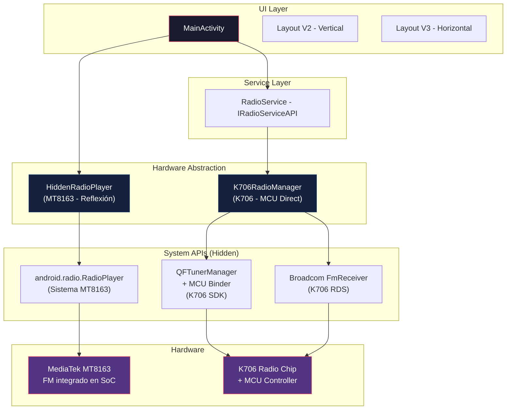

# OpenRadioFM 📻

[]()

[](LICENSE)
[]()
[]()

**Aplicación de radio FM premium para Android Head Units**, con soporte para hardware MediaTek MT8163 y K706.  
Interfaz Glassmorphism, RDS completo (PS, RT, PTY, AF, TA, TP), y personalización avanzada.

<div align="center">
  
  <br>
  
  
</div>

---

## 🎯 Funciones Principales

| Función | MT8163 | K706 |
|---|:---:|:---:|
| Sintonización FM | ✅ | ✅ |
| Seek / AutoScan | ✅ | ✅ |
| RDS PS (nombre emisora) | ✅ | ✅ |
| RDS RT (texto informativo) | ✅ | ✅ |
| RDS PTY (tipo programa) | ✅ | ✅ |
| AF (frecuencias alternativas) | ✅ | ✅ |
| TA (anuncios de tráfico) | ✅ | ✅ |
| TP (indicador) | ✅ | ✅ |
| DX/Local | ✅ | ✅ |
| Stereo / Mono | ✅ | ✅ |
| Layouts múltiples (V2/V3) | ✅ | ✅ |
| Glassmorphism UI | ✅ | ✅ |
| Temas / Night Mode | ✅ | ✅ |
| Logos de emisora | ✅ | ✅ |
| 18 favoritos × 3 bandas | ✅ | ✅ |
| Nav. Hardware Favoritos | ✅ | ✅ |
| Soporte Android Auto | ✅ | ✅ |
| Multilingüe (ES/EN/RU/RO/UK/SR) | ✅ | ✅ |


---

## 🏗️ Arquitectura


```mermaid
graph TB
    subgraph "UI Layer"
        MA[MainActivity]
        L2[Layout V2 - Vertical]
        L3[Layout V3 - Horizontal]
    end

    subgraph "Service Layer"
        RS[RadioService - IRadioServiceAPI]
    end

    subgraph "Hardware Abstraction"
        HRP["HiddenRadioPlayer<br/>(MT8163 - Reflexión)"]
        K706["K706RadioManager<br/>(K706 - MCU Direct)"]
    end

    subgraph "System APIs (Hidden)"
        RP["android.radio.RadioPlayer<br/>(Sistema MT8163)"]
        MCU["QFTunerManager<br/>+ MCU Binder<br/>(K706 SDK)"]
        BC["Broadcom FmReceiver<br/>(K706 RDS)"]
    end

    subgraph "Hardware"
        MT["MediaTek MT8163<br/>FM integrado en SoC"]
        QF["K706 Radio Chip<br/>+ MCU Controller"]
    end

    MA --> RS
    MA --> HRP
    RS --> K706
    HRP --> RP
    K706 --> MCU
    K706 --> BC
    RP --> MT
    MCU --> QF
    BC --> QF

    style MA fill:#1a1a2e,stroke:#e94560,color:#fff
    style HRP fill:#16213e,stroke:#0f3460,color:#fff
    style K706 fill:#16213e,stroke:#0f3460,color:#fff
    style MT fill:#533483,stroke:#e94560,color:#fff
    style QF fill:#533483,stroke:#e94560,color:#fff
```

---

## 📱 Hardware Compatible

| Dispositivo | Chip | Motor | Estado |
|---|---|---|---|
| HCN AutoRadio (ESSGO, JUNSU) | MediaTek MT8163 | `FM_MT8163` | ✅ Completo |
| Radio K706 | K706 + MCU | `FM_K706` | ✅ Completo |
| Radio NWD G5 | NWD Platform | `FM_QS6` | ✅ Beta |
| Otros Android Head Units | Varía | `FM_BASICO` | ⚠️ Solo UI |

---

## 🛠️ Compilación

### Requisitos
- Android Studio Hedgehog+ o SDK 34
- JDK 17
- Gradle 9.x (incluido en wrapper)

### Build
```bash
# Clonar
git clone https://github.com/tu-usuario/OpenRadioFM.git
cd OpenRadioFM

# Compilar
./gradlew assembleDebug

# APK generado en:
# app/build/outputs/apk/debug/app-debug.apk
```

### Instalación en Head Unit
```bash
adb install -r app/build/outputs/apk/debug/app-debug.apk
```

---

## 📖 Documentación

- [Manual de Usuario (Español)](_DOCS/manual_usuario.md)
- [User Manual (English)](_DOCS/manual_user_en.md)
- [Руководство пользователя (Русский)](_DOCS/manual_user_ru.md)
- [Compatibilidad de Hardware](docs/HW_COMPATIBILITY.md)
- [Changelog](CHANGELOG.md)
- [Roadmap](_DOCS/roadmap.md)

---

## 📜 Historial de Versiones

### v4.7.0 "Car & Audio Integration" (Marzo 2026)
- **Soporte Android Auto**: Integración completa mediante `MediaSession` y `MediaBrowserService`. Los favoritos ahora aparecen como una lista navegable en el coche.
- **Refactorización Core**: Modularización de `MainActivity` mediante `NightModeManager`, `HistoryManager` y `PresetManager`.
- **Media Control**: Comando de pausa/play mapeado al botón de Mute para controles remotos y volante.
- **Limpieza de Recursos**: Optimización drástica de `onDestroy` para evitar fugas de memoria en head units con poca RAM.

### v4.6.1 "Stable Integration" (Marzo 2026)
- **Navegación Hardware:** Control de emisoras favoritas directamente desde mandos al volante y botones de hardware (MCU K706 / Reflexión MT8163).
- **Easter Egg Hacker:** Nuevo diálogo de créditos premium con la imagen del desarrollador Jimmy80.
- **Barra de Estado Opcional:** Configuración para mostrar/ocultar la status bar de Android en el Layout 2.
- **Modo Noche Total:** Tintado unificado para todos los indicadores (ST, PTY, AF, TA, TP).


### v4.6 "Beta Integration" (Febrero 2026)
- **Dual Hardware:** Unificación de motores MT8163 y K706 en una sola APK.
- **Soporte QS6 G5:** Integración inicial para plataformas NWD G5.
- **RDS AF/TA/TP:** Funcional en ambos motores con iconos interactivos.
- **Localización:** Añadidos idiomas Rumano, Ucraniano y Serbio.
- **DX/Local:** Toggle funcional para K706 con feedback visual.
- **Layout V3:** Corrección del desplazamiento causado por el icono Stereo.
- **Fuente Formula 1:** Integración tipográfica premium para la frecuencia.
- **Bug Fix:** Corrección de la frecuencia "00.0" en MT8163 durante el arranque.

<details>
<summary>Versiones anteriores</summary>

### v4.5.1 "Server Test"
- Indicador de señal dinámico (verde/amarillo/rojo)
- Layout 3 refinado con Glass Mode
- PTY multilingüe

### v4.0 "Global Edition"
- Multi-Hardware Engine (HCN, MTK, TS, SYU)
- Night Mode con programación horaria

### v3.0 "The Car Experience"
- Rediseño completo de interfaz horizontal (V3)
- Glassmorphism y menús premium

### v2.0b
- Interfaz Glassmorphism y fondos personalizados

### v1.0b
- Versión inicial con sintonización básica y logos
</details>

---

## 📄 Licencia

```
Copyright 2025-2026 Jimmy80

Licensed under the Apache License, Version 2.0.
See LICENSE file for details.
```

---

**Desarrollado con ❤️ por Jimmy80 para la comunidad Android Head Unit.**
