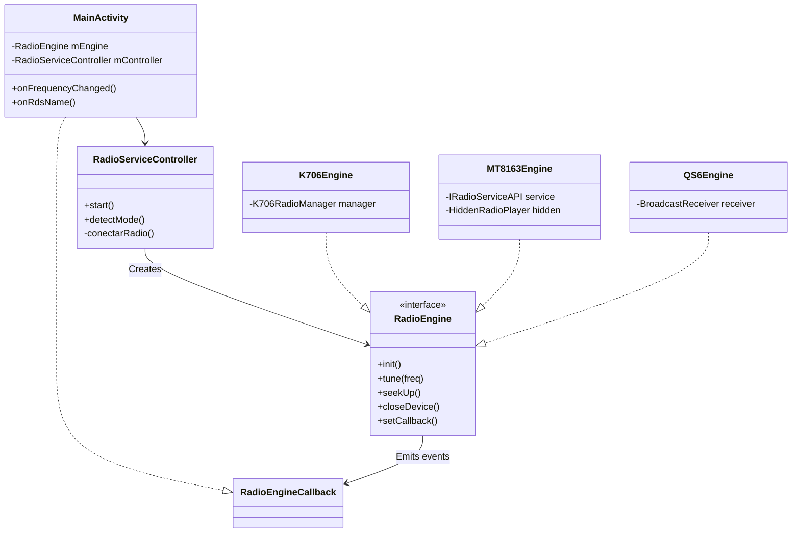

# Arquitectura de Motor de Radio (Refactorización V15)

Este documento describe la nueva estructura modular para la gestión de hardware de radio en OpenRadioFM.

## Resumen de la Arquitectura

Se ha implementado un patrón de **Estrategia (Strategy)** para abstraer las diferencias entre los diversos procesadores y servicios de radio de los coches chinos (K706, MT8163, QS6, etc.).

### Componentes Clave

1.  **`RadioEngine` (Interface)**: Define el contrato único para sintonizar, buscar (seek), cambiar bandas y gestionar RDS.
2.  **`RadioServiceController` (Orquestador)**: Gestiona la detección automática de hardware, la vinculación (binding) a servicios AIDL y la instanciación del motor correcto.
3.  **Motores Concretos**:
    *   `K706Engine`: Comunicación directa vía Bridge/Root (Vento/HCN).
    *   `MT8163Engine`: Motor híbrido AIDL + Reflexión (Topway/Eonon).
    *   `QS6Engine`: Comunicación vía Broadcasts y UART (NWD/Nanis).

## Diagrama de Clases

## Flujo de Datos

1.  `MainActivity` lanza `RadioServiceController`.
2.  `RadioServiceController` detecta el hardware (o usa la preferencia del usuario).
3.  Se vincula al servicio AIDL correspondiente si es necesario.
4.  Se entrega un `RadioEngine` listo a `MainActivity`.
5.  `MainActivity` interactúa con el hardware de forma agnóstica a través de la interfaz.

---
*OpenRadioFM - V15 Professional Refactor*
