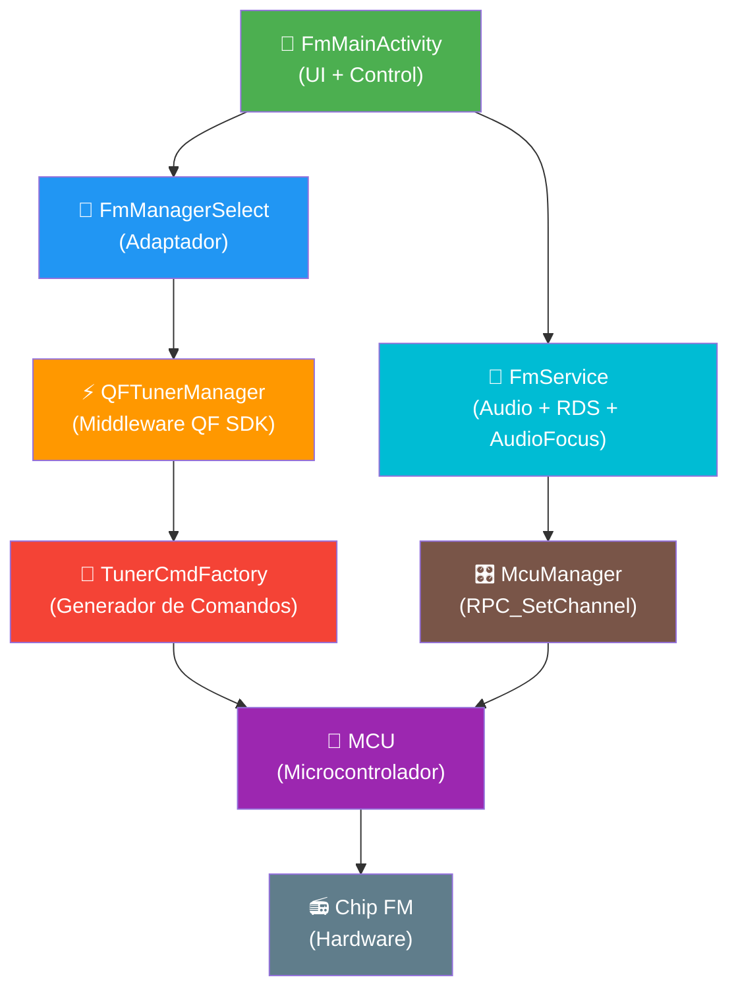

# 🔬 Ingeniería Inversa Completa - Chip FM Radio K706

**Fecha**: 19 Febrero 2026  
**Dispositivo**: K706 Head Unit (Android 10)  
**APK Nativa**: `com.android.fmradio.ext` (Radio_Original.apk)  
**Objetivo**: Mapeo completo del chip FM, todas sus funciones y cómo explotarlas desde OpenRadioFM

---

## 📐 Arquitectura Descubierta: 4 Capas

El análisis del código decompilado revela una arquitectura de **4 capas** que conecta la UI con el hardware FM:



### Capa 1: UI + Servicio (`com.android.fmradio`)
| Clase | Función |
|---|---|
| `FmMainActivity` | Interfaz gráfica, eventos de usuario |
| `FmService` | Servicio de fondo, AudioFocus, AudioPatch, RDS |
| `FmManagerSelect` | Patrón adaptador, delega todo a `TunerManagerForExt` |

### Capa 2: Middleware QF SDK (`com.qf.clientsdk`)
| Clase | Función |
|---|---|
| `QFTunerManager` | Singleton, orquesta comandos tuner |
| `TunerCmdFactory` | Genera los bytes de comando MCU |
| `QFCoreManager` | Gestión del bus IPC MCU |
| `DefaultMcuProcessor` | Procesa respuestas MCU |

### Capa 3: Protocolo MCU (Serial Binario)
| Dirección | Prefijo | Ejemplo |
|---|---|---|
| ARM → MCU | `0xFD` | Tune, Seek, Band, RDS config |
| MCU → ARM | `0xFE` | Status, Freq, RDS data, Presets |

### Capa 4: Broadcom FM (Alternativa/Legado)
| Clase | Función |
|---|---|
| `FmProxy` | Wrapper del servicio Broadcom FM |
| `IFmReceiverService` | AIDL con 25 funciones avanzadas |
| `IFmReceiverCallback` | 10 callbacks asíncronos |

---

## 🎛️ CATÁLOGO COMPLETO DE FUNCIONES DEL CHIP

### A) Comandos ITuner (QF SDK → MCU)

Estos son los **comandos directos** que la app envía al MCU para controlar el chip FM:

| # | Método | Bytes Cmd | Descripción |
|---|---|---|---|
| 1 | `onTune(freq)` | `[0xA0, 0x01, hi, lo]` | Sintonizar frecuencia específica |
| 2 | `tuneExt(band, preset, ?, freq)` | `[0xA0, 0x00, preset\|band, hi, lo]` | Tune extendido con banda+preset |
| 3 | `onSeek(up/down)` | `[0xA0, 0x0C, 0, 0]` / `[0xA0, 0x0D, 0, 0]` | Buscar siguiente/anterior estación |
| 4 | `onNext()` | `[0xA0, 0x0E, 0, 0]` | Preset siguiente |
| 5 | `onPre()` | `[0xA0, 0x0F, 0, 0]` | Preset anterior |
| 6 | `onFine(up/down)` | `[0xA0, 0x03, dir, 0]` | Step fino ±100kHz |
| 7 | `autoScan()` | `[0xA0, 0x08, 0, 0]` | Escaneo automático de toda la banda |
| 8 | `stopScan()` | `[0xA0, 0x09, 0, 0]` | Detener escaneo |
| 9 | `onBand(band)` | `[0xA0, 0x07, band, 0]` | Cambiar banda (FM1/FM2/FM3/AM1/AM2) |
| 10 | `onLoc(mode)` | `[0xA0, 0x0A, mode, 0]` | Modo local (solo estaciones fuertes) |
| 11 | `onPresetSelect(idx)` | `[0xA0, 0x0D, idx, 0]` | Seleccionar preset por índice |
| 12 | `onPresetSave(idx)` | `[0xA0, 0x04, idx, 0]` | Guardar frecuencia actual en preset |
| 13 | `onRadioArea(area)` | `[0xA0, 0x0A, area, 0]` | Cambiar región geográfica |
| 14 | `setPresetList(bytes)` | `[0xA1, data...]` | Cargar lista completa de presets |
| 15 | `setRdsSwitch(on/off)` | `[0xA0, 0x15, state, 0]` | Activar/desactivar RDS |
| 16 | `setRdsTASwitch()` | `[0xA0, 0x12, 0, 0]` | Toggle anuncios de tráfico |
| 17 | `setRdsAFSwitch()` | `[0xA0, 0x10, 0, 0]` | Toggle frecuencias alternativas |
| 18 | `setRdsPtyType(type)` | `[0xA2, ...]` | Establecer filtro de tipo de programa |

### B) Callbacks ITunerTool (MCU → App)

La app recibe estos **eventos del chip** a través del MCU:

| # | Callback | Cmd MCU | Datos |
|---|---|---|---|
| 1 | `onTunerInfoChanged(data)` | `0xB0` | Frecuencia, banda, preset activo, estado |
| 2 | `onTunerPresetListChanged(data)` | `0xB1` | Array de frecuencias guardadas |
| 3 | `onTunerRangInfoChanged(data)` | `0xB2` | Rango de frecuencia min/max/step |
| 4 | `onTuneRdsInfo(data)` | `0xB3` | Estado general RDS |
| 5 | `onTuneRdsIndicateInfo(data)` | `0xB4` | Indicadores RDS (TP, TA, estado) |
| 6 | `onTuneRdsPtyTypeInfo(data)` | `0xB5` | Tipo de programa (PTY) |
| 7 | `onTuneRdsPSInfo(data)` | `0xB6` | Nombre de estación (PS, 8 chars) |
| 8 | `onTuneRdsRTInfo(data)` | `0xB7` | Radio Text (RT, 64 chars) |
| 9 | `onTunerRdsPSPresetListInfo(data)` | `0xB8` | Lista PS de todos los presets |
| 10 | `rds_isStereoPlayStation(stereo)` | — | ¿Estación en estéreo? |
| 11 | `rds_isTPStation(tp)` | — | ¿Estación con programa de tráfico? |
| 12 | `rds_isTAState(ta)` | — | ¿Anuncio de tráfico activo? |
| 13 | `rds_stationNameChange(name)` | — | Nombre PS cambió |
| 14 | `rds_stationRawTextChange(text)` | — | Radio Text cambió |
| 15 | `rds_PTYInfoChange(band, freq, pty)` | — | Tipo de programa cambió |
| 16 | `rds_AFInfoChange(band, freq)` | — | Frecuencia alternativa detectada |
| 17 | `rdsSwitcherChange(state)` | — | RDS habilitado/deshabilitado |
| 18 | `rds_AFSwitcherChange(state)` | — | AF habilitado/deshabilitado |
| 19 | `rds_TASwitcherChange(state)` | — | TA habilitado/deshabilitado |
| 20 | `rds_PTYSwitcherChange(state)` | — | PTY filter habilitado/deshabilitado |
| 21 | `rds_RegionSwitcherChange(state)` | — | Regional habilitado/deshabilitado |
| 22 | `onRds_TA_PlayStateChange(playing)` | — | TA interrumpió la reproducción |
| 23 | `onCurrentFrequencyPICodeChange(pi)` | — | **PI Code** cambió (identificador único de emisora) |
| 24 | `onSetTunerAntennaSupply(type)` | — | Alimentación antena tuner |
| 25 | `onDABSignalFound(found)` | — | ¡**DAB detectado**! (Radio Digital) |
| 26 | `onRequestSetDABPowerSupply(on)` | — | Control alimentación DAB |
| 27 | `onRequestSetDABReset(reset)` | — | Reset módulo DAB |
| 28 | `onSetDABAntennaSupply(on)` | — | Alimentación antena DAB |

### C) Funciones Broadcom IFmReceiverService (Capa Alternativa)

Funciones **avanzadas** del servicio Broadcom FM:

| # | Función | Params | Descripción |
|---|---|---|---|
| 1 | `turnOnRadio(functionalityMask, char[] config)` | int, char[] | Encender radio con configuración |
| 2 | `turnOffRadio()` | — | Apagar radio |
| 3 | `tuneRadio(freq)` | int | Sintonizar frecuencia |
| 4 | `seekStation(scanMode, minSignal)` | int, int | **Buscar con umbral de señal** |
| 5 | `seekStationCombo(startFreq, endFreq, minSignal, scanDirection, scanMultiChannel, rdsType, rdsCondIdx, rdsCondVal)` | 8 params | **Búsqueda avanzadísima con filtros** |
| 6 | `seekRdsStation(scanMode, minSignal, rdsCondType, rdsCondVal)` | 4 params | **Buscar estaciones por tipo RDS** |
| 7 | `seekStationAbort()` | — | Cancelar búsqueda |
| 8 | `muteAudio(mute)` | boolean | Silencio |
| 9 | `setFMVolume(vol)` | int | **Volumen FM independiente** |
| 10 | `setAudioMode(mode)` | int | Estéreo/Mono/Blend |
| 11 | `setAudioPath(path)` | int | **Routing de audio** (Speaker/Headset/None) |
| 12 | `setRdsMode(rdsMode, rdsFeatures, afMode, afThreshold)` | 4 ints | **Config RDS completa con AF threshold** |
| 13 | `setSnrThreshold(threshold)` | int (0-31) | **⭐ UMBRAL SNR** ← ¡Esto es oro! |
| 14 | `setStepSize(stepSize)` | int | Paso de frecuencia |
| 15 | `setWorldRegion(region, deemphasis)` | int, int | Región + deemphasis |
| 16 | `setLiveAudioPolling(enable, interval)` | bool, int | **⭐ MONITOREO EN VIVO de calidad** |
| 17 | `estimateNoiseFloorLevel(mode)` | int (LOW/MED/FINE) | **⭐ NIVEL DE RUIDO** |
| 18 | `cleanupFmService()` | — | Limpiar servicio |
| 19 | `getStatus()` | — | Estado del chip |
| 20 | `getRadioIsOn()` | — | ¿Radio encendida? |
| 21 | `getIsMute()` | — | ¿Silenciado? |
| 22 | `getMonoStereoMode()` | — | Modo audio actual |
| 23 | `getTunedFrequency()` | — | Frecuencia actual |
| 24 | `registerCallback(cb)` | IFmReceiverCallback | Registrar callbacks |
| 25 | `unregisterCallback(cb)` | IFmReceiverCallback | Desregistrar callbacks |

### D) Callbacks Broadcom IFmReceiverCallback

| # | Callback | Datos |
|---|---|---|
| 1 | `onStatusEvent(freq, rssi, snr, isMute, pty, psName, rtText, ptynText, isStereo)` | **⭐ RSSI + SNR en tiempo real** |
| 2 | `onSeekCompleteEvent(freq, rssi, snr, isStereo)` | **RSSI+SNR al encontrar estación** |
| 3 | `onRdsDataEvent(rdsDataType, rdsIndex, rdsText)` | Datos RDS brutos |
| 4 | `onRdsModeEvent(rdsMode, altFreqHopEnabled)` | Modo RDS cambió |
| 5 | `onAudioModeEvent(audioMode)` | Modo audio cambió |
| 6 | `onAudioPathEvent(audioPath)` | Ruta de audio cambió |
| 7 | `onVolumeEvent(status, volume)` | Volumen cambió |
| 8 | `onWorldRegionEvent(worldRegion)` | Región cambió |
| 9 | `onEstimateNflEvent(nfl)` | **⭐ Nivel de ruido estimado** |
| 10 | `onLiveAudioQualityEvent(rssi, snr)` | **⭐ Calidad de audio en VIVO** |

---

## 🔊 Flujo de Audio Completo (Descubierto)

Del análisis del `logcat` de la app nativa, este es el flujo **exacto** que se ejecuta al encender FM:

```
1. FmService.onCreate()
2. FmService.onStartCommand("fmradio.enter")
3. setForceUse(Speaker: false)
4. powerUpAsync(frequency: 92.2)
5. requestAudioFocus(STREAM_MUSIC)
6. handlePowerUp()
7. powerUp(frequency: 92.2)
8. setMute(true)                    ← Silencia mientras sintoniza
9. setVolume(0)
10. firstPlaying(92.2)
11. playFrequency(92.2)
12. enableFmAudio(true)             ← Intenta crear AudioPatch
13. RPC_SetChannel(2)               ← ⭐ CLAVE: Activa canal FM en MCU
14. requestAudioFocus() → granted
15. setMute(false)                  ← Desmutea
16. setVolume(9)                    ← Volumen máximo FM (interno)
```

Al **apagar**:
```
1. powerDownAsync()
2. setMute(true)
3. setVolume(0)
4. enableFmAudio(false)
5. stopRender()
6. RPC_SetChannel(4)               ← ⭐ Canal Android normal
7. abandonAudioFocus()
8. closeDevice()
```

### Canales de Audio MCU (RPC_SetChannel)

| Canal | Código | Uso |
|---|---|---|
| Android Normal | `4` | Audio estándar del sistema |
| **FM Radio** | **`2`** | **Audio del chip FM** |
| Bluetooth? | `1`? | Pendiente verificar |
| AUX? | `3`? | Pendiente verificar |

---

## 🗺️ Regiones Soportadas

Del `FmConstants.smali`:

| # | Región | FM Min | FM Max | FM Step | AM Min | AM Max | AM Step |
|---|---|---|---|---|---|---|---|
| 0 | USA | 8790 | 10810 | 20 | 530 | 1710 | 10 |
| 1 | Sudamérica | 8790 | 10810 | 10 | 520 | 1620 | 10 |
| 2 | Europa Occidental | 8750 | 10800 | 10 | 522 | 1620 | 9 |
| 3 | Europa Oriental | 6500 | 7400 | 3 | 522 | 1620 | 9 |
| 4 | Japón | 7600 | 9000 | 10 | N/A | N/A | N/A |
| 5 | Sudamérica 2 | 7600 | 9000 | 10 | 520 | 1620 | 10 |
| 6 | Sudeste Asiático | 8750 | 10800 | 10 | 531 | 1629 | 9 |

> Frecuencias almacenadas en formato `freqKHz / 10` (ej: 8790 = 87.9 MHz)

---

## 🏷️ Constantes Broadcom FM Importantes

```java
// SNR Thresholds
FM_MAX_SNR_THRESHOLD = 31    // Máxima sensibilidad  
FM_MIN_SNR_THRESHOLD = 0     // Mínima sensibilidad

// Deemphasis
DEEMPHASIS_50U = 0x00        // Europa/Asia (50μs)
DEEMPHASIS_75U = 0x40        // América (75μs)

// Noise Floor Estimation
NFL_LOW  = 0                 // Estimación gruesa
NFL_MED  = 1                 // Estimación media
NFL_FINE = 2                 // Estimación fina (más lenta, más precisa)

// Audio Paths
FM_AUDIO_PATH_NONE    = 0
FM_AUDIO_PATH_SPEAKER = 1
FM_AUDIO_PATH_HEADSET = 2
FM_AUDIO_PATH_UNKNOWN = 3

// RDS Features (bitmask)
RDS_FEATURE_PS   = 0x04     // Programme Service Name
RDS_FEATURE_PTY  = 0x08     // Programme Type
RDS_FEATURE_PTYN = 0x20     // Programme Type Name
RDS_FEATURE_TP   = 0x02     // Traffic Programme
RDS_FEATURE_RT   = 0x01     // Radio Text

// RDS Conditions
RDS_COND_NONE = 0            // Sin filtro
RDS_COND_PTY  = 1            // Filtrar por PTY
RDS_COND_TP   = 2            // Filtrar por Traffic Programme

// Seek Scan Modes (Broadcom)
SCAN_MODE_NORMAL  = 0        // Búsqueda normal
SCAN_MODE_DOWN    = 1        // Hacia abajo
SCAN_MODE_UP      = 2        // Hacia arriba
SCAN_MODE_FULL    = 3        // Escaneo completo banda
```

---

## 🎯 Funciones NO Explotadas por la App Nativa

La app nativa **NO usa** todas las capacidades. Estas son funciones disponibles pero sin explotar:

### ⭐ Funciones de Alta Prioridad para OpenRadioFM

| Función | Fuente | Beneficio |
|---|---|---|
| `setSnrThreshold(0-31)` | Broadcom | Control fino de sensibilidad de búsqueda |
| `estimateNoiseFloorLevel(mode)` | Broadcom | Diagnóstico de entorno RF |
| `setLiveAudioPolling(true, ms)` | Broadcom | Monitoreo RSSI/SNR en tiempo real |
| `onLiveAudioQualityEvent(rssi, snr)` | Broadcom | Barra de calidad de señal REAL |
| `onStatusEvent(..., rssi, snr)` | Broadcom | RSSI y SNR reales (no indicadores indirectos) |
| `seekStationCombo(8 params)` | Broadcom | Búsqueda avanzada con todos los filtros |
| `seekRdsStation(mode, signal, type, val)` | Broadcom | Buscar por tipo RDS específico |
| `onCurrentFrequencyPICodeChange(pi)` | QF SDK | PI Code para identificar emisoras únicas |
| `onDABSignalFound` | QF SDK | Detección de radio digital |
| `setRdsPtyType(type)` | QF SDK | Filtro de programa activo |
| `onRds_TA_PlayStateChange` | QF SDK | Interrupciones de tráfico automáticas |

### 🔧 Funciones de Control Avanzado

| Función | Fuente | Beneficio |
|---|---|---|
| `setAudioPath(path)` | Broadcom | Control directo de routing de audio |
| `setAudioMode(mode)` | Broadcom | Forzar Stereo/Mono/Blend |
| `setWorldRegion(region, deemph)` | Broadcom | Cambio dinámico de región |
| `setStepSize(step)` | Broadcom | Paso de sintonización personalizado |
| `setFMVolume(vol)` | Broadcom | Volumen FM independiente del sistema |
| `setPresetList(bytes)` | QF SDK | Carga masiva de presets |
| `onTunerRangInfoChanged` | QF SDK | Obtener rango de frecuencia del MCU |

---

## 🔑 Protocolo MCU del Tuner (Descifrado)

### Estructura de Comando ARM → MCU

```
[0xA0/0xA1/0xA2] [SubCmd] [Param1] [Param2] [...]
```

| Byte 0 | Significado |
|---|---|
| `0xA0` | Comando de control de tuner (tune, seek, band, etc.) |
| `0xA1` | Configuración de preset list |
| `0xA2` | Configuración RDS |

### Sub-Comandos 0xA0 (Decodificados)

| SubCmd | Función | Params |
|---|---|---|
| `0x00` | Tune extendido | `[preset\|band, freq_hi, freq_lo]` |
| `0x01` | Tune simple | `[freq_hi, freq_lo]` |
| `0x03` | Fine step | `[direction, 0]` |
| `0x04` | Guardar preset | `[index, 0]` |
| `0x07` | Cambiar banda | `[band, 0]` |
| `0x08` | AutoScan iniciar | `[0, 0]` |
| `0x09` | Stop scan (PS) | `[0, 0]` |
| `0x0A` | Loc mode / Region | `[mode/area, 0]` |
| `0x0C` | Seek down | `[0, 0]` |
| `0x0D` | Seek up / Preset select | `[idx, 0]` |
| `0x0E` | Next preset | `[0, 0]` |
| `0x0F` | Previous preset | `[0, 0]` |
| `0x10` | RDS AF Switch | `[0, 0]` |
| `0x12` | RDS TA Switch | `[0, 0]` |
| `0x15` | RDS Switch on/off | `[state, 0]` (Usar 0x00 aquí APAGA la lectura RDS PTY) |

### Respuestas MCU → ARM

| Cmd | Significado | Datos |
|---|---|---|
| `0xB0` | Tuner Info | Freq, band, preset, stereo, estado |
| `0xB1` | Preset List | Array de frecuencias guardadas |
| `0xB2` | Freq Range Info | Min, Max, Step de la banda actual |
| `0xB3` | RDS Info | Estado general RDS |
| `0xB4` | RDS Indicate | TP, TA, indicadores |
| `0xB5` | RDS PTY Type | Tipo de programa (0-31) en byte 2 |
| `0xB6` | RDS PS | Programme Service Name (8 chars) |
| `0xB7` | RDS RT | Radio Text (64 chars) |
| `0xB8` | RDS PS Preset List | Nombres PS de todos los presets |

---

## 🚀 Plan de Implementación para OpenRadioFM v5.0

### Fase 1: Audio Fix (Máxima Prioridad)
- [ ] Implementar `RPC_SetChannel(2)` correctamente al iniciar FM
- [ ] Implementar `RPC_SetChannel(4)` al cerrar FM  
- [ ] Replicar la secuencia completa: `powerUp` → `setMute(true)` → `enableFmAudio` → `RPC_SetChannel(2)` → `setMute(false)` → `setVolume(9)`

### Fase 2: Exprimir Broadcom FM Service
- [ ] Intentar binding a `IFmReceiverService` de Broadcom
- [ ] Si conecta: activar `setLiveAudioPolling(true, 1000)` para RSSI/SNR en vivo
- [ ] Implementar `estimateNoiseFloorLevel(NFL_FINE)` para diagnóstico
- [ ] Usar `setSnrThreshold()` para búsqueda configurable
- [ ] Mostrar barra de señal REAL con datos de `onLiveAudioQualityEvent`

### Fase 3: Explotar ITunerTool Callbacks
- [ ] Registrar listener `ITunerTool` vía `QFTunerManager.setTunerTool()`
- [ ] Capturar `onCurrentFrequencyPICodeChange` para ID único de emisora
- [ ] Implementar `onDABSignalFound` para detectar radio digital
- [ ] Activar `onRds_TA_PlayStateChange` para interrupciones de tráfico

### Fase 4: Búsqueda Avanzada
- [ ] Implementar `seekStationCombo()` con 8 parámetros para búsqueda ultra-configurable
- [ ] Crear UI para `seekRdsStation()` con filtro por tipo de programa
- [ ] Exponer `setSnrThreshold()` en la UI para ajuste de sensibilidad

### Fase 5: Control Total del Chip
- [ ] `setAudioPath()` para routing directo Speaker/Headset
- [ ] `setWorldRegion()` para cambio dinámico de región
- [ ] `setStepSize()` para sintonización personalizada
- [ ] Presets masivos vía `setPresetList()`

---

## ⚡ Métodos de Acceso desde OpenRadioFM

### Opción A: QF SDK vía Reflection (Recomendada)
```java
// Obtener QFTunerManager
Class<?> clazz = Class.forName("com.qf.clientsdk.QFTunerManager");
Method getInstance = clazz.getMethod("getInstance");
Object tunerManager = getInstance.invoke(null);

// Ejemplo: Tune a frecuencia
Method onTune = clazz.getMethod("onTune", int.class);
onTune.invoke(tunerManager, 96900); // 96.9 MHz

// Ejemplo: Seek up
Method onSeek = clazz.getMethod("onSeek", boolean.class);
onSeek.invoke(tunerManager, true); // true = up
```

### Opción B: Broadcom FM Service vía Binding
```java
Intent intent = new Intent();
intent.setComponent(new ComponentName(
    "com.broadcom.bt.app.fm",
    "com.broadcom.bt.app.fm.FmReceiverService"
));
context.bindService(intent, serviceConnection, Context.BIND_AUTO_CREATE);
```

### Opción C: MCU Directo vía McuManager (RPC)
```java
// Ya implementado en K706RadioManager
Class<?> mcuClass = Class.forName("android.qf.mcu.McuManager");
Method setChannel = mcuClass.getMethod("RPC_SetChannel", int.class);
setChannel.invoke(mcuManager, 2); // Canal FM
```

---

## 📊 Comparación: App Nativa vs OpenRadioFM

| Funcionalidad | App Nativa | OpenRadioFM (Actual) | Potencial |
|---|---|---|---|
| Tune básico | ✅ | ✅ | ✅ |
| Seek arriba/abajo | ✅ | ✅ | ✅ |
| AutoScan | ✅ | ✅ | ✅ |
| RDS PS (nombre) | ✅ | ✅ | ✅ |
| RDS RT (texto) | ✅ | ✅ | ✅ |
| RDS PTY | ✅ | ✅ | ✅ |
| Estéreo/Mono | ✅ | ✅ | ✅ |
| Presets (6/banda) | ✅ | ✅ | ✅ |
| Audio directo | ✅ (RPC_SetChannel) | ❌ | ✅ |
| RSSI/SNR real | ❌ | ❌ | **✅** (Broadcom) |
| Barra de calidad | ❌ | ❌ (indirecta) | **✅** (Live Polling) |
| Buscar por tipo RDS | ❌ | ❌ | **✅** |
| Búsqueda combo | ❌ | ❌ | **✅** |
| SNR configurable | ❌ | ❌ | **✅** |
| Noise floor | ❌ | ❌ | **✅** |
| PI Code | ❌ | ❌ | **✅** |
| Detección DAB | ❌ | ❌ | **✅** |
| Audio path control | ❌ | ❌ | **✅** |
| TA interrupciones | ❌ | ❌ | **✅** |
| Volumen FM indep. | ❌ | ❌ | **✅** |

> La app nativa usa **menos del 40%** de las capacidades del chip.  
> OpenRadioFM puede potencialmente explotar el **100%**.

---

## ⚠️ Notas Técnicas

> [!IMPORTANT]
> El K706 tiene **DOS stacks FM** simultáneos:
> 1. **QF SDK** (activo) - Se comunica con MCU vía protocolo serial binario
> 2. **Broadcom FM Service** (presente pero posiblemente dormido) - Interfaz AIDL directa
> 
> Ambos están disponibles en el sistema. Hay que probar cuál responde.

> [!CAUTION]
> **Peligro con `0x15` (RDS Switch)**: Se ha verificado empíricamente (20 Feb 2026) que enviar el comando `0xA0 0x15 0x00 0x00` (pensando que reseteaba filtros PTY) en realidad **desactiva completamente la emisión del payload PTY** desde el firmware de la MCU Android (El byte se queda atascado en 0 permanentemente en el paquete `0xB5`). Evitar utilizar a menos que sea para desactivar el decodificador entero.

> [!WARNING]
> El `FmService` de la app nativa necesita `android.uid.system` (sharedUserId) para acceder a `McuManager`.
> OpenRadioFM debe usar **reflection** para acceder a estas APIs del sistema ya que no tiene permisos de sistema.

> [!NOTE]
> Los datos de DAB (`onDABSignalFound`, `onRequestSetDABPowerSupply`, etc.) sugieren que el hardware
> **podría tener un módulo DAB** disponible. Esto abre la puerta a radio digital (FM+).

---

*Documento de referencia para el desarrollo de OpenRadioFM v5.0 - The Engineering Update*
*Basado en análisis de smali decompilado de Radio_Original.apk (com.android.fmradio.ext)*
