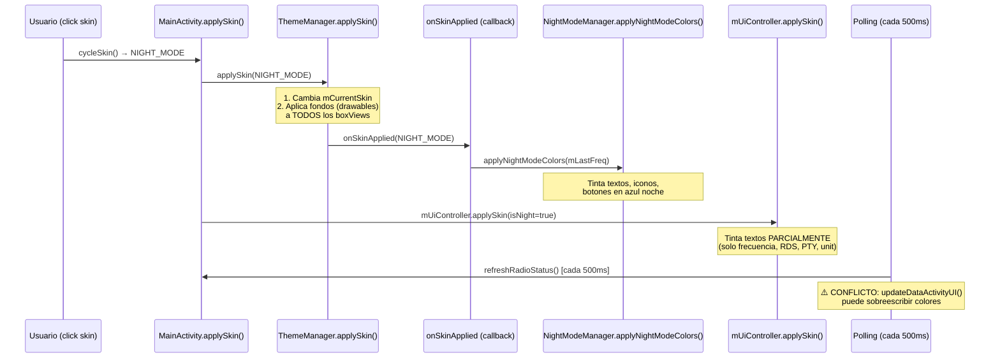

# 🌙 Análisis del Retraso en el Tintado del Modo Noche

## Problema Reportado
Al cambiar de skin y llegar al modo noche, algunos elementos tardan unos segundos en tintarse de azul noche.

## Flujo de Ejecución Actual



---

## 🔴 Causas Raíz Identificadas

### 1. **Orden de ejecución: fondos ANTES que colores**

En [ThemeManager.java:162-300](file:///c:/@MIS%20PROYECTOS/K706_RE/OpenRadioFM/app/src/main/java/com/example/openradiofm/ui/theme/ThemeManager.java#L162-L300):

```java
// 1. Primero cambia todos los fondos (drawables)
this.mCurrentSkin = skin;
for (int id : viewIds) {
    v.setBackgroundResource(drawableId); // ← Cambio visual INMEDIATO
}
// 2. DESPUÉS notifica al listener
mListener.onSkinApplied(skin); // ← Aquí se pintan los azules TARDE
```

> [!IMPORTANT]
> Los fondos se aplican instantáneamente, pero los colores azul noche (textos, iconos, botones) se aplican **después** en el callback [onSkinApplied()](file:///c:/@MIS%20PROYECTOS/K706_RE/OpenRadioFM/app/src/main/java/com/example/openradiofm/ui/theme/ThemeManager.java#50-51). Esto crea una ventana visible donde los fondos ya son oscuros pero los textos/iconos siguen en blanco.

### 2. **El `mUiController.applySkin()` sólo cubre PARTE de los elementos**

En [MainLayoutController.java:115-131](file:///c:/@MIS%20PROYECTOS/K706_RE/OpenRadioFM/app/src/main/java/com/example/openradiofm/ui/main/MainLayoutController.java#L115-L131), [applySkin(isNight)](file:///c:/@MIS%20PROYECTOS/K706_RE/OpenRadioFM/app/src/main/java/com/example/openradiofm/ui/theme/ThemeManager.java#158-302) solo tinta:
- `tvFrequency`, `tvRdsName`, `tvRdsInfo`, `tvPty`, `ivUnitLabel`

**Pero NO tinta estos elementos** (que sí cubre `NightModeManager.applyNightModeColors()`):
- ❌ Botones: `btnSeekUp`, `btnSeekDown`, `btnFavPrev`, `btnFavNext`, `btnBand`, etc.
- ❌ Iconos RDS: `ivAfIcon`, `ivTaIcon`, `ivTpIcon`, `ivStereoIcon`
- ❌ Icono de banda: `ivBandIndicator`
- ❌ Presets P1-P18 (textos y logos)
- ❌ Reloj digital: `tvDigitalClock`

> [!WARNING]
> Los elementos que NO están en `mUiController.applySkin()` dependen EXCLUSIVAMENTE de que `NightModeManager.applyNightModeColors()` se ejecute primero, y luego que el polling periódico los mantenga. Si hay cualquier retraso en este callback, esos elementos quedan en blanco durante 1-2 segundos.

### 3. **Race condition con el polling de [refreshRadioStatus()](file:///c:/@MIS%20PROYECTOS/K706_RE/OpenRadioFM/app/src/main/java/com/example/openradiofm/ui/main/MainActivity.java#1617-1824)**

En [MainActivity.java:356-363](file:///c:/@MIS%20PROYECTOS/K706_RE/OpenRadioFM/app/src/main/java/com/example/openradiofm/ui/main/MainActivity.java#L356-L363):

```java
mPollingExecutor.scheduleAtFixedRate(() -> {
    refreshRadioStatus(); // Cada 500ms desde otro hilo
}, 500, 500, TimeUnit.MILLISECONDS);
```

Dentro de [refreshRadioStatus()](file:///c:/@MIS%20PROYECTOS/K706_RE/OpenRadioFM/app/src/main/java/com/example/openradiofm/ui/main/MainActivity.java#1617-1824), se llama a [updateFrequencyDisplay()](file:///c:/@MIS%20PROYECTOS/K706_RE/OpenRadioFM/app/src/main/java/com/example/openradiofm/ui/main/MainActivity.java#L1986-L2009) y [handleFrequencyChange()](file:///c:/@MIS%20PROYECTOS/K706_RE/OpenRadioFM/app/src/main/java/com/example/openradiofm/ui/main/MainActivity.java#L1770-L1785), que ejecutan:

```java
mUiController.applySkin(isNight); // Líneas 1785 y 1996
```

Esto **compite con** `NightModeManager.applyNightModeColors()` porque:
- [isNight](file:///c:/@MIS%20PROYECTOS/K706_RE/OpenRadioFM/app/src/main/java/com/example/openradiofm/ui/main/NightModeManager.java#74-101) se evalúa contra `mThemeManager.getActiveSkin()` 
- Pero si el polling ejecuta esta línea ANTES de que [ThemeManager](file:///c:/@MIS%20PROYECTOS/K706_RE/OpenRadioFM/app/src/main/java/com/example/openradiofm/ui/theme/ThemeManager.java#15-303) haya actualizado `mCurrentSkin`, [isNight](file:///c:/@MIS%20PROYECTOS/K706_RE/OpenRadioFM/app/src/main/java/com/example/openradiofm/ui/main/NightModeManager.java#74-101) será `false` y **resetea a blanco** los pocos elementos que sí cubre

### 4. **El re-tintado del polling está throttleado a 30 segundos**

En [MainActivity.java:197](file:///c:/@MIS%20PROYECTOS/K706_RE/OpenRadioFM/app/src/main/java/com/example/openradiofm/ui/main/MainActivity.java#L197):

```java
private static final long NIGHT_MODE_CHECK_INTERVAL_MS = 30_000; // 30 SEGUNDOS
```

Si el primer tintado falla o se sobreescribe, el mecanismo de "re-asegurado" de la línea 1645 **no se ejecutará hasta 30 segundos después**.

---

## 📋 Mapa de Elementos y Quién los Tinta

| Elemento | `ThemeManager.applySkin()` | [NightModeManager](file:///c:/@MIS%20PROYECTOS/K706_RE/OpenRadioFM/app/src/main/java/com/example/openradiofm/ui/main/NightModeManager.java#19-326) | `UiController.applySkin()` | Polling [refreshRadioStatus](file:///c:/@MIS%20PROYECTOS/K706_RE/OpenRadioFM/app/src/main/java/com/example/openradiofm/ui/main/MainActivity.java#1617-1824) |
|---|:---:|:---:|:---:|:---:|
| Fondos (backgrounds) | ✅ | ❌ | ❌ | ❌ |
| `tvFrequency` | ❌ | ✅ | ✅ | ✅ (via uiController) |
| `tvRdsName/Info` | ❌ | ✅ | ✅ | ✅ (via uiController) |
| `tvPty` | ❌ | ✅ | ✅ | ❌ |
| `ivUnitLabel` | ❌ | ❌ | ✅ | ❌ |
| `ivBandIndicator` | ❌ | ✅ | ❌ | ❌ |
| Botones (seekUp, etc.) | ❌ | ✅ | ❌ | ❌ |
| Iconos RDS (af/ta/tp) | ❌ | ✅ | ❌ | ❌ |
| Presets P1-P18 | ❌ | ✅ | ❌ | ❌ |
| `tvDigitalClock` | ❌ | ✅ | ❌ | ❌ |
| `ivDataActivityIcon` | ❌ | ✅ | ❌ | ✅ (updateDataActivityUI) |

> [!CAUTION]
> Los **botones**, **iconos RDS**, **presets** y el **reloj** solo se tintan desde `NightModeManager.applyNightModeColors()`, que se ejecuta en el callback [onSkinApplied()](file:///c:/@MIS%20PROYECTOS/K706_RE/OpenRadioFM/app/src/main/java/com/example/openradiofm/ui/theme/ThemeManager.java#50-51). Si ese callback se retrasa o si otro proceso sobreescribe los colores antes de que llegue, esos elementos quedan sin tinte azul noche hasta que el polling los re-tinte (30s después).

---

## Conclusión

El retraso se debe a una **arquitectura dispersa** del tintado: hay 4 lugares distintos que aplican colores (ThemeManager, NightModeManager, UiController, polling), y no están sincronizados. Al cambiar de skin, los fondos se aplican primero y los colores azules se aplican después en un callback, creando una ventana visible de "elementos sin tintar".
