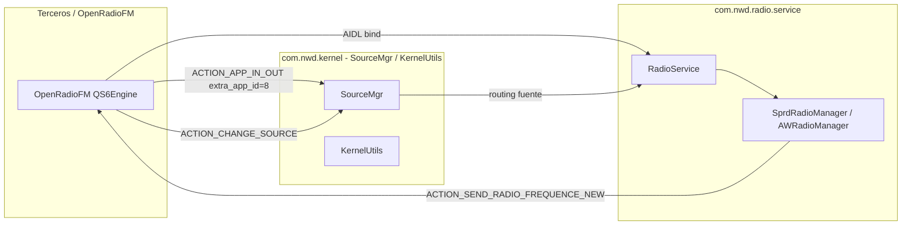

# Fase A — Mapa del sistema NWD

**Fuentes:** (1) APKs descompilados en `K706_RE/QS NWD/tools/` (2) **captura ADB en unidad real** (§A.0).  
**Fecha análisis:** 2026-03-21  

---

## A.0 Captura unidad real (ADB)

*Salida obtenida con los comandos de `scripts/nwd_pm_info.bat` / `docs/nwd_adb_comandos_windows.md`.*

### Rutas APK (radio + kernel)

| Paquete | Ruta en la unidad |
|---------|-------------------|
| `com.nwd.radio` | `package:/data/smallota/app/com.nwd.radio/com.nwd.radio.apk` → **OTA / partición datos** (actualizable) |
| `com.nwd.radio.service` | `package:/system/app/8925_Carkit_RadioService_VP2.1.6/8925_Carkit_RadioService_VP2.1.6.apk` → **/system** (Carkit) |
| `com.nwd.kernel` | `package:/system/app/8925_Carkit_KernelService_VP2.3.2/8925_Carkit_KernelService_VP2.3.2.apk` → **/system** (coherente con versionName **2.3.2**) |

### Copias locales en PC (ingeniería inversa)

**Carpeta acordada:** `C:\@MIS PROYECTOS\K706_RE\QS NWD\tools\`

Ahí se guardan los APK **extraídos de la unidad** (`adb pull`), junto a los árboles ya descompilados (`nwd_radio_service_decompiled`, `nwd_kernel_service_decompiled`, etc.). Tras una OTA, vuelve a hacer pull y renombra o versiona el archivo si hace falta.

Ejemplo (ejecutar desde `platform-tools`, destino la carpeta anterior):

```bat
adb pull /data/smallota/app/com.nwd.radio/com.nwd.radio.apk "C:\@MIS PROYECTOS\K706_RE\QS NWD\tools\com.nwd.radio_1.1.0.3.apk"
adb pull /system/app/8925_Carkit_RadioService_VP2.1.6/8925_Carkit_RadioService_VP2.1.6.apk "C:\@MIS PROYECTOS\K706_RE\QS NWD\tools\"
adb pull /system/app/8925_Carkit_KernelService_VP2.3.2/8925_Carkit_KernelService_VP2.3.2.apk "C:\@MIS PROYECTOS\K706_RE\QS NWD\tools\"
```

### Versiones (orden de ejecución `dumpsys`)

| Paquete | versionCode | versionName | minSdk | targetSdk |
|---------|-------------|-------------|--------|-----------|
| `com.nwd.radio` | **1103** | **1.1.0.3** | 17 | 25 |
| `com.nwd.radio.service` | **216** | **2.1.6** | 19 | 19 |
| `com.nwd.kernel` | **232** | **2.3.2** | 19 | 19 |

*Firma común en los tres bloques reportados: misma signing (esperable en ROM OEM).*

### Inventario `pm list packages` (prefijo `com.nwd`)

| Paquete | Notas (rol aproximado) |
|---------|-------------------------|
| `com.nwd.radio` | UI radio FM |
| `com.nwd.radio.service` | Servicio AIDL / tuner |
| `com.nwd.kernel` | Kernel / SourceMgr / routing |
| `com.nwd.setting.service` | Ajustes / servicio setting NWD |
| `com.nwd.android.music.ui` | Música ARM |
| `com.nwd.android.video.ui` | Vídeo ARM |
| `com.nwd.android.phone` | Teléfono / BT |
| `com.nwd.bt.music` | Bluetooth music |
| `com.nwd.audioset` | Audio settings |
| `com.nwd.filemanager` | Explorador |
| `com.nwd.media.scanner` | Escaneo medios |
| `com.nwd.system.core` | Núcleo sistema NWD |
| `com.nwd.factory.setting` | Ajustes fábrica |
| `com.nwd.production.test` / `com.nwd.complete.test` / `com.nwd.vodka.factory` | Test / fábrica |
| `com.nwd.can.*` | CAN (setting, help) |
| `com.nwd.camera.*` | Cámara |
| `com.nwd.carstore.service` / `com.nwd.carad.service` / `com.nwd.mycar` | Servicios “coche” |
| `com.nwd.ui.skin*` / `com.nwd.guidebookskin` / `com.nwd.changeskin.service` | Temas / skins |
| `com.nwd.splitscreen` / `com.nwd.highlauncherselector` | Launcher / multitarea |
| `com.nwd.voice.analyze` | Voz |
| `com.nwd.cpumonitor` / `com.nwd.usb2cvbs` / `com.nwd.traversalfile` | Utilidades |
| `com.nwd.check.appver` | Comprobación versiones |
| `com.nwd.whole.machine` | Diagnóstico máquina |
| `com.nwd.btemission` | BT emisión |

**Implicación para ingeniería inversa:** los APK en **`/system`** (`RadioService` **VP2.1.6**, `KernelService` **VP2.3.2**) pueden no coincidir con copias antiguas en disco — conviene **`adb pull`** tras cada OTA a **`QS NWD\tools`** (ver § arriba).

---

## A.1 Paquetes NWD identificados en manifests (descompilado)

| Paquete | Rol | Proceso / notas | Manifest (ruta tools) |
|---------|-----|-----------------|------------------------|
| `com.nwd.radio` | **UI** radio (launcher / actividad) | App con `ACCESS_FM_RADIO`, `MODIFY_AUDIO_ROUTING` | `nwd_radio_decompiled/AndroidManifest.xml` |
| `com.nwd.radio.service` | **Servicio** IPC + lógica tuner (AIDL `RadioService`) | Incluye en el dex clases `com.nwd.kernel.*`, `com.nwd.radio.arm.*` (mismo APK o fusión build) | `nwd_radio_service_decompiled/AndroidManifest.xml` |
| `com.nwd.kernel` | **Kernel / SourceMgr** (setting compartido) | `android:sharedUserId="com.nwd.kernel.setting"`, proceso `com.nwd.kernel.setting` | `nwd_kernel_service_decompiled/AndroidManifest.xml` |

### Componentes declarados en XML (solo lo estático)

**`com.nwd.radio`**
- Actividad launcher: `com.nwd.radio.home_horizontalActivity` (MAIN/LAUNCHER).  
- *Nota:* `ApplicationList.xml` del kernel referencia `com.nwd.radio.RadioActivity` — puede ser otra variante de build o actividad secundaria; contrastar con JADX del APK de **tu** unidad.

**`com.nwd.radio.service`**
- Servicio: `.RadioService` → intent `com.nwd.radio.service.ACTION_RADIO_SERVICE`.

**`com.nwd.kernel`**
- Servicio: `.service.KernelService` → `com.nwd.kernel.service.KernelService`.
- Receiver: `.service.BootReceiver` → `BOOT_COMPLETED`.

La mayoría de **receivers de `com.nwd.action.*`** se registran **en código** (`registerReceiver`), no en el manifest — el mapa de §A.3 es por inspección smali.

---

## A.2 `ApplicationList.xml` — AppID ↔ radio (crítico para `extra_app_id`)

Archivo: `nwd_kernel_service_decompiled/assets/ApplicationList.xml`  
(Comentarios internos OEM: IDs alineados con `SourceConstant`.)

| AppID | Paquete | Actividad (XML) | Source | SourceProperty |
|-------|---------|-----------------|--------|----------------|
| **4** | `com.android.launcher` | `Launcher` | 0 | — |
| **8** | **`com.nwd.radio`** | `com.nwd.radio.RadioActivity` | **4** | **1 (audio)** |
| 255 | *(terceros)* | vacío | -1 | 3 |

**Conclusión:** Para que la lógica tipo `SprdRadioManager$1` trate la entrada como la **app de radio oficial**, el broadcast `ACTION_APP_IN_OUT` debe llevar **`extra_app_id = 8`** (no 4 ni otro). OpenRadioFM ya alinea esto en `QS6Engine`.

Otras entradas relevantes del mismo archivo: música ARM (2), video (3), BT (10/15), DVD, AUX, variantes CAN (`com.nwd.can.radio` AppID **235**, etc.) — útiles si en otro vehículo la radio CAN sustituye a `com.nwd.radio`.

---

## A.3 Mapa de broadcasts `com.nwd.action.*` (radio + kernel)

### Constantes maestras
- `com.nwd.kernel.utils.KernelConstant` (presente en **kernel** y copia en **radio_service** smali).

### Acciones usadas en cadena **radio FM / fuente** (prioridad OpenRadioFM)

| Acción | Emisor típico (smali) | Receptor / consumidor típico |
|--------|------------------------|------------------------------|
| `ACTION_APP_IN_OUT` | Apps / `KernelUtils` | `SprdRadioManager$1`, `AWRadioManager$1`, `SourceMgr` |
| `ACTION_CHANGE_SOURCE` | Radio, kernel | `SprdRadioManager`, `RadioService`, SourceMgr |
| `ACTION_KEY_VALUE` | Sistema | `RadioService`, `SourceMgr`, reglas de fuente |
| `ACTION_START_NWD_ACTIVITY` | Apps | `SprdRadioManager` (despertar stack) |
| `ACTION_SET_RADIO_FREQUENCE` | UI / intents | `RadioService` |
| `ACTION_SEND_RADIO_FREQUENCE` / `_NEW` | Servicio ARM | Managers RDS/UI, **shadow** OpenRadioFM |
| `ACTION_SEND_SCAN_RADIO_FREQUENCE` | Servicio | UI / estado scan |
| `ACTION_RADIO_STATE` | Servicio | Estado on/off |
| `ACTION_MCU_POWER_OFF` | MCU | `SprdRadioManager`, `SourceMgr` |
| `ACTION_VOLUME_STATE_CHANGE` | Audio | `SprdRadioManager`, `AWRadioManager`, `NaviVolumeReceiver` |
| `ACTION_REQUEST_CHANGE_SOURCE` | Varios | `SourceMgr` |
| `ACTION_REQUEST_GOTO_CURRENT_SOURCE` | Varios | `KernelUtils` / SourceMgr |

### Diagrama (flujo simplificado FM)



---

## A.4 Checklist “en unidad real”

- [x] Ejecutado — resultados en **§A.0**.
- Repetir tras **OTA** o cambio de ROM y actualizar tablas de versiones / rutas.

Comandos (Windows, `.\adb` en `platform-tools`):

```bat
.\adb shell pm list packages | findstr nwd
.\adb shell pm path com.nwd.radio
.\adb shell pm path com.nwd.radio.service
.\adb shell pm path com.nwd.kernel
.\adb shell dumpsys package com.nwd.radio | findstr version
.\adb shell dumpsys package com.nwd.radio.service | findstr version
.\adb shell dumpsys package com.nwd.kernel | findstr version
```

Opcional: comparar **versionCode** con `nwd.build.time` en el manifest de la UI si haces `apktool` del APK extraído.

---

## A.5 Estado respecto al plan maestro

| Tarea Fase A | Estado |
|--------------|--------|
| Listar paquetes `com.nwd.*` y rol | **Hecho** — §A.0 (unidad) + §A.1 (descompilado) |
| Manifest exportado / diagrama emisor–receptor | **Hecho** (§A.3 + mermaid); detalle por método en Fase B |
| Localizar `ApplicationList.xml` y AppID radio | **Hecho** (§A.2, AppID **8**) |
| Validación ADB versiones / rutas | **Hecho** (§A.0) |

---

*Anexo al estudio: `docs/ESTUDIO_INGENIERIA_INVERSA_APP_NATIVA_NWD.md`*
